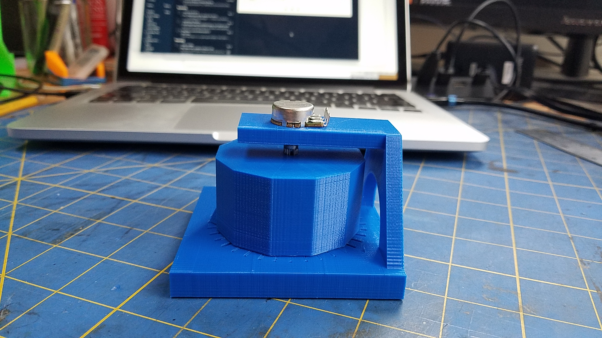
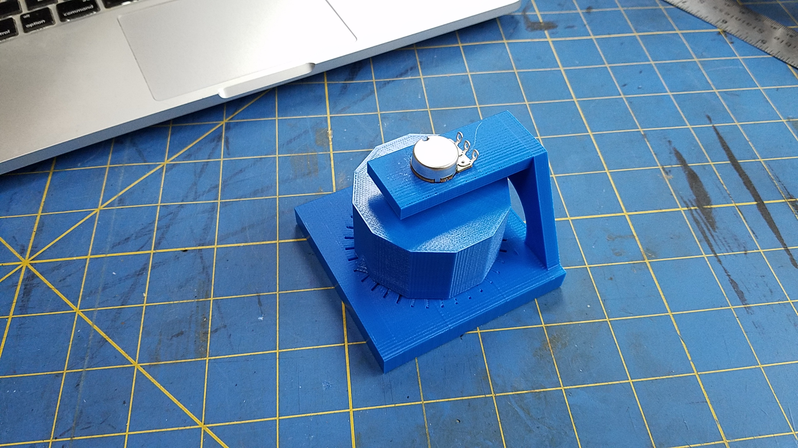
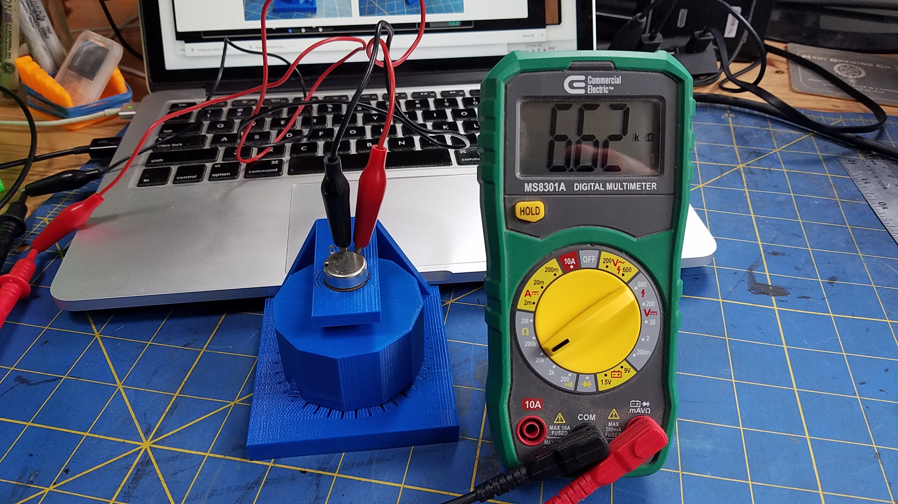
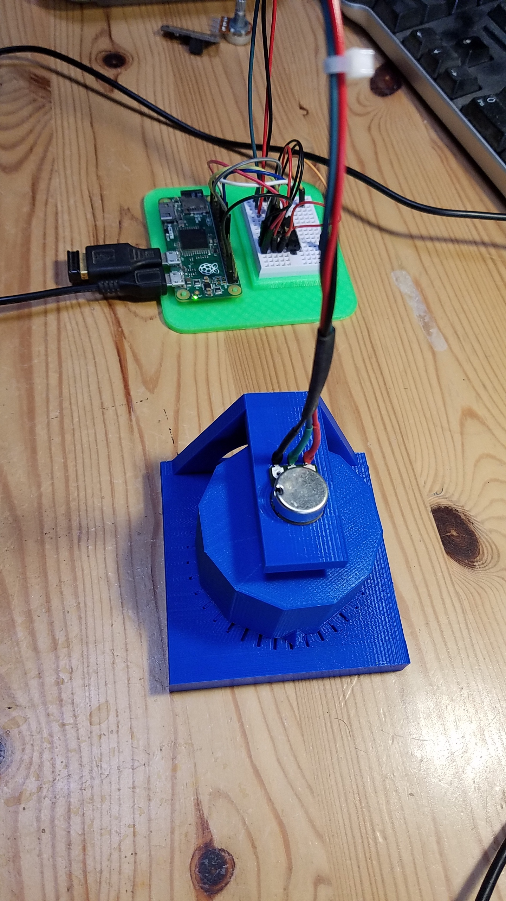

# Linear Potentiometers as feedback devices
Linear potentiometers (like a [`B10K` or similar](https://www.allelectronics.com/item/nltp-50k/50k-linear-taper-pot-6mm-shaft/1.html)) are called this way because their resistance varies _linearly_
when their knob is turned.


Because of this feature, they can also be used as a feedback device.

Let's say you have a motor (servo, stepper, DC motor...) that rotates some hardware 
(like a door, a solar panel, etc. whatever can be oriented), and you need to know what the position (its angle in this case) of this hardware device is.

- This is particularly meaningful when the motor does not know about the state of the device it is moving or driving.
    It understands "move forward" or "move backward", "slow down" or "speed up", but knows nothing about "Move it 30 degrees forward" or "Back it up 0.5 degrees"... 
    This is where extra knowledge is necessary, _feedback_ is the way we call it: _You drive me, I tell you where I am._ 

If the linear potentiometer is conveniently hooked up to the hardware, then it can certainly be used
to measure this angle (possibly after some calibration step).

## Test hardware
For the sake of this demo, we use some 3D-printed device, `STL` and `scad` files required to 3D-print it are available
[here](https://github.com/OlivierLD/3DPrinting/tree/master/OpenSCAD/MiscParts).

When assembling the device, make sure the middle position of the potentiometer is
centered, so you have the same freedom clockwise and counter-clockwise.

|  |  |
|:-------------------------------------:|:---------------------------------------:|

Wire it like this:


With this setting, you turn the knob by hand (this replaces the motor), and we will see
what the resistance of the potentiometer is.

## Let's go
If we hookup a multimeter to the potentiometer, we can get readings from it:

|  |  |  |
|:----------------------------------:|:----------------------------------:|:------------------------------------:|
| Centered                           | ~60&deg; clockwise                 | ~60&deg; counter-clockwise           |


We consider that `0` is half way between the min (knob all the way clockwise, highest resistance) and max (knob all the way counter-clockwise, lowest resistance).
  
Taking measures every 30 degrees, we have the following table:

| Knob Angle | Resistance |
|------:|-----------:|
| -120&deg;| 0.27 k&Omega;| 
| -90&deg;| 1.35 k&Omega;| 
| -60&deg;| 2.42 k&Omega;| 
| -30&deg;| 3.55 k&Omega;| 
| 0&deg;| 4.67 k&Omega;| 
| +30&deg;| 5.78 k&Omega;| 
| +60&deg;| 6.78 k&Omega;| 
| +90&deg;| 7.78 k&Omega;| 
| +120&deg;| 8.74 k&Omega;| 

Rendered on a spreadsheet like that:


It does indeed look linear.

## Automated reading
Let's use a Raspberry Pi to take care of the reading.
The Raspberry Pi does *not* have analog pins, we will use and ADC to do the job.
`MCP3002` or `MCP3008`.

### Example: with an `MCP3008`

Sample setup, with the same device hooked-up to a Raspberry Pi Zero connected to an MCP3008:



First step, **calibration**, follow instructions at the prompt:
```
$ ./feedback.mcp3008.sh --miso:23 --mosi:24 --clk:18 --cs:25 --channel:0
Read an MCP3008 ADC, for orientation (angle) feedback
+----------------+
| 1: Calibration |
| 2: For real    |
+------------+---+
| Q: Bye     |
+------------+
You choose > 
```
Choose `1`
```
 You choose > 1
Usage is ./feedback.mcp3008.sh --miso:9 --mosi:10 --clk:11 --cs:8 --channel:0
 ! IMPORTANT: For miso, mosi, clk & cs, use BCM pin numbers
Usage is java adcbenchmark.mcp3008.MainMCP3008Sample33Feedback --miso:9 --mosi:10 --clk:11 --cs:8 --channel:0
Values above are default values (GPIO/BCM numbers).

Reading MCP3008 on channel 0
 Wiring of the MCP3008-SPI (without power supply):
 +---------++-----------------------------------------------+
 | MCP3008 || Raspberry Pi                                  |
 +---------++------+------------+------+---------+----------+
 |         || Pin# | Name       | Role | GPIO    | wiringPI |
 |         ||      |            |      | /BCM    | /PI4J    |
 +---------++------+------------+------+---------+----------+
 | CLK (13)|| #12  | PCM_CLK/PWM0 | CLK  | GPIO_18 | 01       |
 | Din (11)|| #18  | GPIO_5     | MOSI | GPIO_24 | 05       |
 | Dout(12)|| #16  | GPIO_4     | MISO | GPIO_23 | 04       |
 | CS  (10)|| #22  | GPIO_6     | CS   | GPIO_25 | 06       |
 +---------++------+------------+-----+----------+----------+
Raspberry Pi is the Master, MCP3008 is the Slave:
- Dout on the MCP3008 goes to MISO on the RPi
- Din on the MCP3008 goes to MOSI on the RPi
Pins on the MCP3008 are numbered from 1 to 16, beginning top left, counter-clockwise.
       +--------+ 
* CH0 -+  1  16 +- Vdd 
  CH1 -+  2  15 +- Vref 
  CH2 -+  3  14 +- aGnd 
  CH3 -+  4  13 +- CLK 
  CH4 -+  5  12 +- Dout 
  CH5 -+  6  11 +- Din 
  CH6 -+  7  10 +- CS 
  CH7 -+  8   9 +- dGnd 
       +--------+ 
       +-----+-----+--------------+-----++-----+--------------+-----+-----+
       | BCM | wPi | Name         |  Physical  |         Name | wPi | BCM |
       +-----+-----+--------------+-----++-----+--------------+-----+-----+
       |     |     | 3v3          | #01 || #02 |          5v0 |     |     |       
       |  02 |  08 | SDA1         | #03 || #04 |          5v0 |     |     |       
       |  03 |  09 | SCL1         | #05 || #06 |          GND |     |     |       
       |  04 |  07 | GPCLK0       | #07 || #08 |    UART0_TXD | 15  | 14  |       
       |     |     | GND          | #09 || #10 |    UART0_RXD | 16  | 15  |       
       |  17 |  00 | GPIO_0       | #11 || #12 | PCM_CLK/PWM0 | 01  | 18  | CLK   
       |  27 |  02 | GPIO_2       | #13 || #14 |          GND |     |     |       
       |  22 |  03 | GPIO_3       | #15 || #16 |       GPIO_4 | 04  | 23  | Dout  
       |     |     | 3v3          | #17 || #18 |       GPIO_5 | 05  | 24  | Din   
       |  10 |  12 | SPI0_MOSI    | #19 || #20 |          GND |     |     |       
       |  09 |  13 | SPI0_MISO    | #21 || #22 |       GPIO_6 | 06  | 25  | CS    
       |  11 |  14 | SPI0_CLK     | #23 || #24 |   SPI0_CS0_N | 10  | 08  |       
       |     |     | GND          | #25 || #26 |   SPI0_CS1_N | 11  | 07  |       
       |     |  30 | SDA0         | #27 || #28 |         SCL0 | 31  |     |       
       |  05 |  21 | GPCLK1       | #29 || #30 |          GND |     |     |       
       |  06 |  22 | GPCLK2       | #31 || #32 |         PWM0 | 26  | 12  |       
       |  13 |  23 | PWM1         | #33 || #34 |          GND |     |     |       
       |  19 |  24 | PCM_FS/PWM1  | #35 || #36 |      GPIO_27 | 27  | 16  |       
       |  26 |  25 | GPIO_25      | #37 || #38 |      PCM_DIN | 28  | 20  |       
       |     |     | GND          | #39 || #40 |     PCM_DOUT | 29  | 21  |       
       +-----+-----+--------------+-----++-----+--------------+-----+-----+
       | BCM | wPi | Name         |  Physical  |         Name | wPi | BCM |
       +-----+-----+--------------+-----++-----+--------------+-----+-----+
- Rotate the potentiometer to find the position where Volume is 50%
- Then move 90 degrees clockwise, and note the ADC value XXXX.
- Then move 90 degrees counter-clockwise, and note the ADC value YYYY.
You will use those values in the real world, using the runtime arguments --minus90:XXXX and --plus90:YYYY
Volume: 049.0% (ADC: 0501) => 1.616 V.
Volume: 049.2% (ADC: 0503) => 1.623 V.
Volume: 049.7% (ADC: 0508) => 1.639 V.
Volume: 050.4% (ADC: 0516) => 1.665 V.
Volume: 050.6% (ADC: 0518) => 1.671 V.
Volume: 050.1% (ADC: 0513) => 1.655 V.
Volume: 050.3% (ADC: 0515) => 1.661 V.
Volume: 050.1% (ADC: 0513) => 1.655 V.
Volume: 049.9% (ADC: 0510) => 1.645 V.
Volume: 050.0% (ADC: 0512) => 1.652 V.
Volume: 050.3% (ADC: 0515) => 1.661 V.
Volume: 050.0% (ADC: 0512) => 1.652 V.
Volume: 050.5% (ADC: 0517) => 1.668 V.
Volume: 050.0% (ADC: 0512) => 1.652 V.
```
Value `512` found, now move on:
```
Volume: 050.3% (ADC: 0515) => 1.661 V.
Volume: 050.1% (ADC: 0513) => 1.655 V.
Volume: 050.5% (ADC: 0517) => 1.668 V.
Volume: 050.2% (ADC: 0514) => 1.658 V.
Volume: 050.0% (ADC: 0512) => 1.652 V.
Volume: 049.8% (ADC: 0509) => 1.642 V.
Volume: 050.0% (ADC: 0511) => 1.648 V.
Volume: 050.1% (ADC: 0513) => 1.655 V.
Volume: 050.0% (ADC: 0511) => 1.648 V.
Volume: 050.1% (ADC: 0513) => 1.655 V.
Volume: 050.3% (ADC: 0515) => 1.661 V.
Volume: 050.1% (ADC: 0513) => 1.655 V.
Volume: 046.9% (ADC: 0480) => 1.548 V.
Volume: 040.6% (ADC: 0415) => 1.339 V.
Volume: 033.4% (ADC: 0342) => 1.103 V.
Volume: 027.9% (ADC: 0285) => 0.919 V.
Volume: 024.5% (ADC: 0251) => 0.810 V.
Volume: 022.6% (ADC: 0231) => 0.745 V.
Volume: 021.7% (ADC: 0222) => 0.716 V.
Volume: 020.7% (ADC: 0212) => 0.684 V.
Volume: 020.0% (ADC: 0205) => 0.661 V.
Volume: 019.6% (ADC: 0200) => 0.645 V.
Volume: 018.9% (ADC: 0193) => 0.623 V.
Volume: 018.3% (ADC: 0187) => 0.603 V.
Volume: 017.8% (ADC: 0182) => 0.587 V.
Volume: 017.5% (ADC: 0179) => 0.577 V.
Volume: 017.1% (ADC: 0175) => 0.565 V.
Volume: 016.9% (ADC: 0173) => 0.558 V.
```
For `-90` degrees, ADC is `173`, move on.
```
Volume: 017.5% (ADC: 0179) => 0.577 V.
Volume: 019.6% (ADC: 0201) => 0.648 V.
Volume: 023.5% (ADC: 0240) => 0.774 V.
Volume: 028.5% (ADC: 0292) => 0.942 V.
Volume: 035.4% (ADC: 0362) => 1.168 V.
Volume: 043.3% (ADC: 0443) => 1.429 V.
Volume: 050.6% (ADC: 0518) => 1.671 V.
Volume: 057.3% (ADC: 0586) => 1.890 V.
Volume: 060.2% (ADC: 0616) => 1.987 V.
Volume: 061.6% (ADC: 0630) => 2.032 V.
Volume: 068.0% (ADC: 0696) => 2.245 V.
Volume: 071.2% (ADC: 0728) => 2.348 V.
Volume: 075.7% (ADC: 0774) => 2.497 V.
Volume: 078.9% (ADC: 0807) => 2.603 V.
Volume: 078.7% (ADC: 0805) => 2.597 V.
Volume: 079.1% (ADC: 0809) => 2.610 V.
Volume: 080.2% (ADC: 0820) => 2.645 V.
Volume: 081.5% (ADC: 0834) => 2.690 V.
Volume: 082.7% (ADC: 0846) => 2.729 V.
Volume: 083.2% (ADC: 0851) => 2.745 V.
Volume: 084.0% (ADC: 0859) => 2.771 V.
Volume: 084.4% (ADC: 0863) => 2.784 V.
Volume: 084.8% (ADC: 0867) => 2.797 V.
Volume: 085.0% (ADC: 0870) => 2.806 V.
Volume: 085.3% (ADC: 0873) => 2.816 V.
Volume: 085.5% (ADC: 0875) => 2.823 V.
Volume: 085.3% (ADC: 0873) => 2.816 V.
Volume: 085.5% (ADC: 0875) => 2.823 V.
Volume: 085.3% (ADC: 0873) => 2.816 V.
Volume: 085.5% (ADC: 0875) => 2.823 V.
Volume: 085.3% (ADC: 0873) => 2.816 V.
Volume: 085.5% (ADC: 0875) => 2.823 V.
Volume: 085.3% (ADC: 0873) => 2.816 V.
Volume: 085.5% (ADC: 0875) => 2.823 V.
Volume: 085.3% (ADC: 0873) => 2.816 V.
Volume: 085.7% (ADC: 0877) => 2.829 V.
Volume: 085.5% (ADC: 0875) => 2.823 V.
Volume: 085.3% (ADC: 0873) => 2.816 V.
Volume: 085.5% (ADC: 0875) => 2.823 V.
Volume: 085.3% (ADC: 0873) => 2.816 V.
Volume: 085.5% (ADC: 0875) => 2.823 V.
Volume: 085.3% (ADC: 0873) => 2.816 V.
Volume: 085.5% (ADC: 0875) => 2.823 V.
Volume: 085.3% (ADC: 0873) => 2.816 V.
Volume: 085.5% (ADC: 0875) => 2.823 V.
Volume: 085.3% (ADC: 0873) => 2.816 V.
Volume: 085.5% (ADC: 0875) => 2.823 V.
Volume: 085.3% (ADC: 0873) => 2.816 V.
Volume: 085.5% (ADC: 0875) => 2.823 V.
Volume: 085.3% (ADC: 0873) => 2.816 V.
Volume: 085.5% (ADC: 0875) => 2.823 V.
```
For `+90` degrees, ADC is `875`. Stop the program.
```
^C

Shutting down.
Bye, freeing resources.
Done.
```

Values to remember:
- for `-90`: `173`
- for `+90`: `875`

Now for real. Restart the program, and input values for `-90` and `+90` from the command line when prompted:
```
pi@rpi-dev-16gb:~/raspberry-coffee/ADC-benchmark $ ./feedback.mcp3008.sh --miso:23 --mosi:24 --clk:18 --cs:25 --channel:0
Read an MCP3008 ADC, for orientation (angle) feedback
+----------------+
| 1: Calibration |
| 2: For real    |
+------------+---+
| Q: Bye     |
+------------+
You choose > 
```
Choose `2`
```
You choose > 2
ADC value for -90 degrees > 173
ADC value for +90 degrees > 875
Usage is ./feedback.mcp3008.sh --miso:9 --mosi:10 --clk:11 --cs:8 --channel:0
 ! IMPORTANT: For miso, mosi, clk & cs, use BCM pin numbers
Usage is java adcbenchmark.mcp3008.MainMCP3008Sample33Feedback --miso:9 --mosi:10 --clk:11 --cs:8 --channel:0
Values above are default values (GPIO/BCM numbers).

Reading MCP3008 on channel 0
 Wiring of the MCP3008-SPI (without power supply):
 +---------++-----------------------------------------------+
 | MCP3008 || Raspberry Pi                                  |
 +---------++------+------------+------+---------+----------+
 |         || Pin# | Name       | Role | GPIO    | wiringPI |
 |         ||      |            |      | /BCM    | /PI4J    |
 +---------++------+------------+------+---------+----------+
 | CLK (13)|| #12  | PCM_CLK/PWM0 | CLK  | GPIO_18 | 01       |
 | Din (11)|| #18  | GPIO_5     | MOSI | GPIO_24 | 05       |
 | Dout(12)|| #16  | GPIO_4     | MISO | GPIO_23 | 04       |
 | CS  (10)|| #22  | GPIO_6     | CS   | GPIO_25 | 06       |
 +---------++------+------------+-----+----------+----------+
Raspberry Pi is the Master, MCP3008 is the Slave:
- Dout on the MCP3008 goes to MISO on the RPi
- Din on the MCP3008 goes to MOSI on the RPi
Pins on the MCP3008 are numbered from 1 to 16, beginning top left, counter-clockwise.
       +--------+ 
* CH0 -+  1  16 +- Vdd 
  CH1 -+  2  15 +- Vref 
  CH2 -+  3  14 +- aGnd 
  CH3 -+  4  13 +- CLK 
  CH4 -+  5  12 +- Dout 
  CH5 -+  6  11 +- Din 
  CH6 -+  7  10 +- CS 
  CH7 -+  8   9 +- dGnd 
       +--------+ 
       +-----+-----+--------------+-----++-----+--------------+-----+-----+
       | BCM | wPi | Name         |  Physical  |         Name | wPi | BCM |
       +-----+-----+--------------+-----++-----+--------------+-----+-----+
       |     |     | 3v3          | #01 || #02 |          5v0 |     |     |       
       |  02 |  08 | SDA1         | #03 || #04 |          5v0 |     |     |       
       |  03 |  09 | SCL1         | #05 || #06 |          GND |     |     |       
       |  04 |  07 | GPCLK0       | #07 || #08 |    UART0_TXD | 15  | 14  |       
       |     |     | GND          | #09 || #10 |    UART0_RXD | 16  | 15  |       
       |  17 |  00 | GPIO_0       | #11 || #12 | PCM_CLK/PWM0 | 01  | 18  | CLK   
       |  27 |  02 | GPIO_2       | #13 || #14 |          GND |     |     |       
       |  22 |  03 | GPIO_3       | #15 || #16 |       GPIO_4 | 04  | 23  | Dout  
       |     |     | 3v3          | #17 || #18 |       GPIO_5 | 05  | 24  | Din   
       |  10 |  12 | SPI0_MOSI    | #19 || #20 |          GND |     |     |       
       |  09 |  13 | SPI0_MISO    | #21 || #22 |       GPIO_6 | 06  | 25  | CS    
       |  11 |  14 | SPI0_CLK     | #23 || #24 |   SPI0_CS0_N | 10  | 08  |       
       |     |     | GND          | #25 || #26 |   SPI0_CS1_N | 11  | 07  |       
       |     |  30 | SDA0         | #27 || #28 |         SCL0 | 31  |     |       
       |  05 |  21 | GPCLK1       | #29 || #30 |          GND |     |     |       
       |  06 |  22 | GPCLK2       | #31 || #32 |         PWM0 | 26  | 12  |       
       |  13 |  23 | PWM1         | #33 || #34 |          GND |     |     |       
       |  19 |  24 | PCM_FS/PWM1  | #35 || #36 |      GPIO_27 | 27  | 16  |       
       |  26 |  25 | GPIO_25      | #37 || #38 |      PCM_DIN | 28  | 20  |       
       |     |     | GND          | #39 || #40 |     PCM_DOUT | 29  | 21  |       
       +-----+-----+--------------+-----++-----+--------------+-----+-----+
       | BCM | wPi | Name         |  Physical  |         Name | wPi | BCM |
       +-----+-----+--------------+-----++-----+--------------+-----+-----+

```
Range parameters are validated, 1st degree function is elaborated, see if this is right:
```
Function coefficients: 
	a: 0.256410,
	b:-134.358974

Parameter validation:
ADC=0512 -> -3.076923º
ADC=0173 -> -90.000000º
ADC=0875 -> 90.000000º
ADC=0000 -> -134.358974º
ADC=1023 -> 127.948718º
```
Notice the min and max angle (`-134º`, `+128º`), this may reflect a small offset in the potentiometer position, which is OK.
This is what the calibration step is here for.

Now turn the knob back and forth:
```
Volume: 050.0% (0511) => 1.648 V, -03.33 degree(s)
Volume: 050.1% (0513) => 1.655 V, -02.82 degree(s)
Volume: 049.9% (0510) => 1.645 V, -03.59 degree(s)
Volume: 050.0% (0512) => 1.652 V, -03.08 degree(s)
Volume: 049.9% (0510) => 1.645 V, -03.59 degree(s)
Volume: 050.0% (0512) => 1.652 V, -03.08 degree(s)
Volume: 049.9% (0510) => 1.645 V, -03.59 degree(s)
Volume: 050.0% (0512) => 1.652 V, -03.08 degree(s)
Volume: 049.9% (0510) => 1.645 V, -03.59 degree(s)
Volume: 048.5% (0496) => 1.600 V, -07.18 degree(s)
Volume: 046.6% (0477) => 1.539 V, -12.05 degree(s)
Volume: 045.0% (0460) => 1.484 V, -16.41 degree(s)
Volume: 043.6% (0446) => 1.439 V, -20.00 degree(s)
Volume: 042.2% (0432) => 1.394 V, -23.59 degree(s)
Volume: 040.9% (0418) => 1.348 V, -27.18 degree(s)
Volume: 039.3% (0402) => 1.297 V, -31.28 degree(s)
Volume: 038.5% (0394) => 1.271 V, -33.33 degree(s)
Volume: 038.2% (0391) => 1.261 V, -34.10 degree(s)
Volume: 038.4% (0393) => 1.268 V, -33.59 degree(s)
Volume: 040.1% (0410) => 1.323 V, -29.23 degree(s)
Volume: 041.4% (0424) => 1.368 V, -25.64 degree(s)
Volume: 043.2% (0442) => 1.426 V, -21.03 degree(s)
Volume: 045.0% (0460) => 1.484 V, -16.41 degree(s)
Volume: 046.7% (0478) => 1.542 V, -11.79 degree(s)
Volume: 048.7% (0498) => 1.606 V, -06.67 degree(s)
Volume: 051.2% (0524) => 1.690 V, +00.00 degree(s)
Volume: 053.4% (0546) => 1.761 V, +05.64 degree(s)
Volume: 055.7% (0570) => 1.839 V, +11.79 degree(s)
Volume: 057.6% (0589) => 1.900 V, +16.67 degree(s)
Volume: 058.9% (0603) => 1.945 V, +20.26 degree(s)
Volume: 059.9% (0613) => 1.977 V, +22.82 degree(s)
Volume: 060.9% (0623) => 2.010 V, +25.38 degree(s)
Volume: 061.2% (0626) => 2.019 V, +26.15 degree(s)
Volume: 061.0% (0624) => 2.013 V, +25.64 degree(s)
Volume: 061.2% (0626) => 2.019 V, +26.15 degree(s)
Volume: 060.7% (0621) => 2.003 V, +24.87 degree(s)
Volume: 058.6% (0599) => 1.932 V, +19.23 degree(s)
Volume: 057.1% (0584) => 1.884 V, +15.38 degree(s)
Volume: 055.4% (0567) => 1.829 V, +11.03 degree(s)
Volume: 054.0% (0552) => 1.781 V, +07.18 degree(s)
Volume: 052.8% (0540) => 1.742 V, +04.10 degree(s)
Volume: 052.0% (0532) => 1.716 V, +02.05 degree(s)
Volume: 051.6% (0528) => 1.703 V, +01.03 degree(s)
Volume: 051.1% (0523) => 1.687 V, -00.26 degree(s)
Volume: 050.9% (0521) => 1.681 V, -00.77 degree(s)
Volume: 050.7% (0519) => 1.674 V, -01.28 degree(s)
Volume: 051.1% (0523) => 1.687 V, -00.26 degree(s)
Volume: 051.6% (0528) => 1.703 V, +01.03 degree(s)
Volume: 050.9% (0521) => 1.681 V, -00.77 degree(s)
Volume: 051.3% (0525) => 1.694 V, +00.26 degree(s)
Volume: 051.1% (0523) => 1.687 V, -00.26 degree(s)
Volume: 050.5% (0517) => 1.668 V, -01.79 degree(s)
Volume: 051.0% (0522) => 1.684 V, -00.51 degree(s)
Volume: 050.8% (0520) => 1.677 V, -01.03 degree(s)
Volume: 051.2% (0524) => 1.690 V, +00.00 degree(s)
Volume: 051.4% (0526) => 1.697 V, +00.51 degree(s)
Volume: 051.2% (0524) => 1.690 V, +00.00 degree(s)
Volume: 051.0% (0522) => 1.684 V, -00.51 degree(s)
Volume: 050.8% (0520) => 1.677 V, -01.03 degree(s)
Volume: 051.0% (0522) => 1.684 V, -00.51 degree(s)
Volume: 050.7% (0519) => 1.674 V, -01.28 degree(s)
Volume: 050.9% (0521) => 1.681 V, -00.77 degree(s)
Volume: 051.1% (0523) => 1.687 V, -00.26 degree(s)
Volume: 050.9% (0521) => 1.681 V, -00.77 degree(s)
Volume: 051.1% (0523) => 1.687 V, -00.26 degree(s)
Volume: 050.9% (0521) => 1.681 V, -00.77 degree(s)
^C
Shutting down.
Bye, freeing resources.
Done.

```
Angle is displayed as the knob is moved.

Seems that this kind of hardware could be used to detect what we are looking for here.

---
