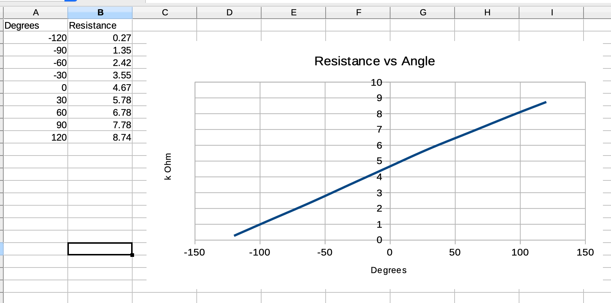

## Linear Potentiometers as feedback
Linear potentiometer like a [`B10K` or similar](https://www.allelectronics.com/item/nltp-50k/50k-linear-taper-pot-6mm-shaft/1.html) are called this way because their resistance varies linearly
when their knob is turned.

Because of this feature, they can also be used as a feedback device.

Let's say you have a motor (servo, Stepper, DC motor...) that rotates some hardware 
(like a door, a solar panel, etc.), and you need to know what the position (angle in this case) of this hardware device.

It the linear potentiometer is conveniently hooked to the hardware, then it can certainly be used
to measure this angle (possibly after some calibration step).

#### Test hardware
For the sake of this demo, we provide some 3D-printed device, `STL` and `scad` files are available
[here](https://github.com/OlivierLD/3DPrinting/tree/master/OpenSCAD/MiscParts).

|  |  |
|:-------------------------------------:|:---------------------------------------:|

Wire it like this:

With this setting, you turn the knob by hand (this replaces the motor), and we will see
what the resistance of the potentiometer is.

#### Let's go
If we hookup a multimeter to the potentiometer, we can get readings from it:

|  |  |  |
|:----------------------------------:|:----------------------------------:|:------------------------------------:|
| Centered                           | ~60&deg; right                     | ~60&deg; left                        |

Taking measures every 30 degrees, we have the following table:

| Angle | Resistance |
|------:|-----------:|
| -120&deg;| 0.27 k&Omega;| 
| -90&deg;| 1.35 k&Omega;| 
| -60&deg;| 2.42 k&Omega;| 
| -30&deg;| 3.55 k&Omega;| 
| 0&deg;| 4.67 k&Omega;| 
| +30&deg;| 5.78 k&Omega;| 
| +60&deg;| 6.78 k&Omega;| 
| +90&deg;| 7.78 k&Omega;| 
| +120&deg;| 8.74 k&Omega;| 

Rendered on a spreadsheet like that:

It does indeed look linear.

#### Automated reading
Let's use a Raspberry Pi to take care of the reading.
The Raspberry Pi does *not* have analog pins, we will use and ADC to do the job.
`MCP3002` or `MCP3008`.

---
