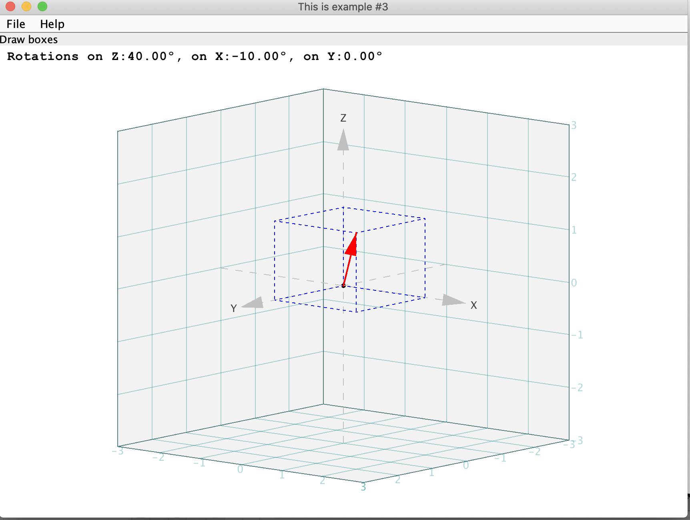
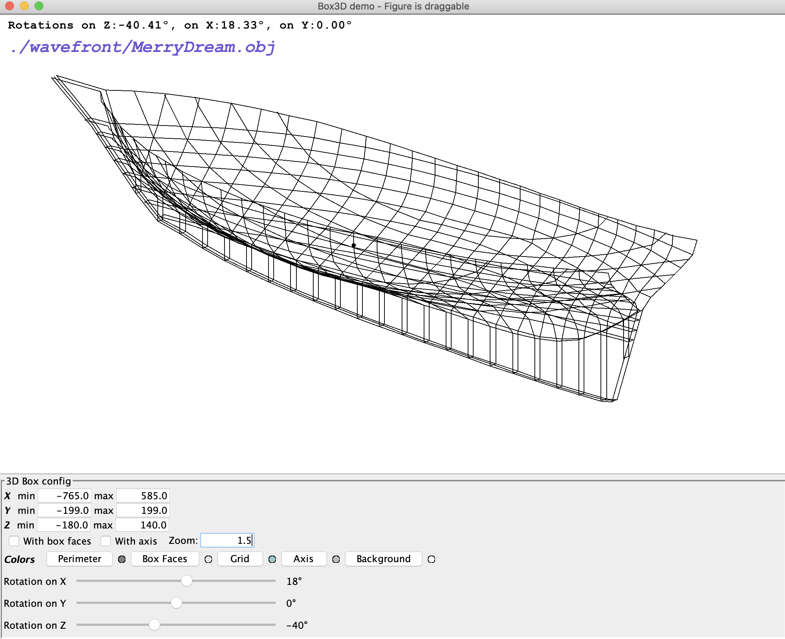

## Linear Algebra

Basic linear algebra ([الجبر](https://en.wikipedia.org/wiki/Algebra)), and statistical functions. Work in progress.
- Square matrix
- System resolution
- Least squares method (regression)
- Derivative
- Standard deviation and others
- etc.

---

Two different aspects are presented in this module.

- Some algebra implementation functions
- Some ways to render graphics, in 2 and 3D.

Several Python libraries already provide this kind of features, and they can be consumed
by Jupyter Notebooks.

This might not be the only way. That's what we want to show here.
There is no reason why Java should lag behind.
And `HTML5/CSS3/ES6` should also be able to implement the same kind of features as well. 

We'll see.

## Java Graphics (Generic Swing Graphics, GSG)

This module also includes a _Swing based Java_ library for graphics (2 & 3D), that can be used in pure Swing applications,
as well as in Jupyter Notebooks (IJava). 

- Jupyter examples provided in the `jupyter` folder.
- Swing examples provided in the `gsg.examples` package, in the `test` folder. 

Try this:
```
$ ../gradlew runSample
```

#### Some utility methods
In those utilities, just provide the (spatial, absolute) vertices of the points, segments, arrows and boxes to draw.
Rotations and space-to-screen operations are taken care of, from the context.

##### `drawBox`, `drawArrow`
```java
Consumer<Graphics2D> afterDrawer = g2d -> {
    // Draw a box
    g2d.setColor(Color.BLUE);
    // Dotted lines for the cube
    g2d.setStroke(new BasicStroke(1,
            BasicStroke.CAP_BUTT,
            BasicStroke.JOIN_ROUND,
            1.0f,
            new float[] { 2f, 0f, 2f },
            2f));
    double[][] boxVertex = {
            {0.0, 0.0, 1.5},
            {0.0, 2.0, 1.5},
            {2.0, 2.0, 1.5},
            {2.0, 0.0, 1.5},
            {0.0, 0.0, 0.0},
            {0.0, 2.0, 0.0},
            {2.0, 2.0, 0.0},
            {2.0, 0.0, 0.0}
    };
    box3D.drawBox.accept(g2d, boxVertex);
    // An arrow
    g2d.setColor(Color.RED);
    g2d.setStroke(new BasicStroke(2));
    box3D.drawArrow(g2d,
            new double[] {0.0, 0.0, 0.0},
            new double[] {2.0, 2.0, 1.5});
};
box3D.setAfterDrawer(afterDrawer);
```


##### `drawSurroundingBox`, `drawSegment`
```java
Consumer<Graphics2D> afterDrawer = g2d -> {
    // Define vertices
    double[] spatialPointOne = new double[] { 1d, 1d, 1d};
    double[] spatialPointTwo = new double[] { 2d, 3d, -1.5d};
    double[] spatialPointThree = new double[] { -2.5d, -2d, -1d};

    // Draw surrounding boxes
    g2d.setColor(Color.BLUE);
    // Dotted lines for the cube
    g2d.setStroke(new BasicStroke(1,
            BasicStroke.CAP_BUTT,
            BasicStroke.JOIN_ROUND,
            1.0f,
            new float[] { 2f, 0f, 2f },
            2f));
    box3D.drawSurroundingBox(g2d, spatialPointOne, spatialPointTwo);
    // A segment
    g2d.setStroke(new BasicStroke(2));
    box3D.drawSegment(g2d, spatialPointOne, spatialPointTwo);

    g2d.setColor(Color.RED);
    // Dotted lines for the cube
    g2d.setStroke(new BasicStroke(1,
            BasicStroke.CAP_BUTT,
            BasicStroke.JOIN_ROUND,
            1.0f,
            new float[] { 2f, 0f, 2f },
            2f));
    box3D.drawSurroundingBox(g2d, spatialPointTwo, spatialPointThree);
    // A segment
    g2d.setStroke(new BasicStroke(2));
    box3D.drawSegment(g2d, spatialPointTwo, spatialPointThree);
};
box3D.setAfterDrawer(afterDrawer);
```


### WaveFront format (`obj`) support


### See the `src/test/java` folder
This directory contains demos.

### Bonus: LaTex in Markdown
> Works fine in a Jupyter Notebook, not always on a standalone markdown document...

There are good documents about all that [here](https://towardsdatascience.com/write-markdown-latex-in-the-jupyter-notebook-10985edb91fd), 
and [here](https://colab.research.google.com/drive/18_2yFdH8G-6NXY_7fTcshMoScgJ-SYac#scrollTo=VFaCoSXvS-_H).

```
Euler's identity: $ e^{i \pi} + 1 = 0 $
```

```
Given : $\pi = 3.14$ , $\alpha = \frac{3\pi}{4}\, rad$
$$
\omega = 2\pi f \\
f = \frac{c}{\lambda}\\
\lambda_0=\theta^2+\delta\\
\Delta\lambda = \frac{1}{\lambda^2}
$$
```

To see the result, look [here](./jupyter/LeastSquare.ipynb).

### TODO: A JavaScript (HTML5 canvas) equivalent version
- WebComponent?

---
