# Case study (WIP) Full NavServer running on a Raspberry Pi Zero W, A+, and others...
This is a case study, using different hardware configurations to run the same software configuration (the full RESTNavServer).

The hardware configuration will be made out of two parts:
- The machine (different Raspberry Pi models)
- The Hardware Attached on Top (HAT)

The HAT will have two configurations, involving pretty much the same components:
- Two push buttons
- A 128x64 OLED screen
- A BME280 (temperature, humidity, pressure sensor)
- In the Raspberry Zero case, we will also have
    - A power switch
    - An Adafruit Ultimate GPS
- For the Raspberry Pi A and B cases, the GPS will be external, plugged on a USB port.  

> OLED Screen and push buttons will be used to interact with the system, for monitoring purpose.

**Features**:
- 2 [Adafruit Bonnets](https://www.adafruit.com/product/3203), $4.50 each
    - One with a [132x64 oled screen](https://www.adafruit.com/product/938), $19.95, 2 push buttons, 1 switch for the power supply
    - One with the [Adafruit Ultimate GPS](https://www.adafruit.com/product/746), $39.95, and a [BME280](https://www.adafruit.com/product/2652) (Humidity, Temperature, Atmospheric Pressure), $19.95
- LiPo battery
- Buttons can be used to scroll through the different displays
    - also features a "local" menu (to be browsed with the buttons) that can execute different tasks, easy to customize like
        - Pausing the logging
        - Resuming the logging
        - Shutting down the Multiplexer
        - Shutting down the machine (see below)
        - etc...
    - Activate a screen saver mode
- A specific combination on the buttons can shut down the machine.

> Prices, August 2019.

---

This example shows how to _**extend**_  the `NavServer`.

It shows how to add features like **TWO** push-buttons, and take ownership of a screen (Nokia, SSD1306...)

It comes with a class named `navserver.ServerWithKewlButtons`, that extends the `navrest.NavServer`.
As a result, it's driven by the exact same `properties` file.

To see how to interact with the buttons (to start and stop the logging for example, or
to shutdown the whole server), look for the variables named `pbmOne` and `pbmShift`.

Implements `simple-click`, `double-click`, and `long-click`.

```java
final static PushButtonMaster pbmOne = new PushButtonMaster();
final static PushButtonMaster pbmTwo = new PushButtonMaster();
```

> Note: the code to add here is just there for the buttons management. There is _absolutely no code_
> to add for the `BME280`, the GPS, or the `SSD1306` screen. It is all taken care of by the properties files.

> See `nmea.mux.gps.log.properties` to know how to reference those devices, and 
> `ssd1306.properties` to see how to choose the data to display on the oled screen. 

This is built just like the other examples in this module, just run
```
 $ ./builder.sh
 ```
 and follow the instructions in the console.

---

### A first prototype
| Pressure (BME280) | Position (GPS) | Side view |
|:--:|:--:|:--:|
|  | 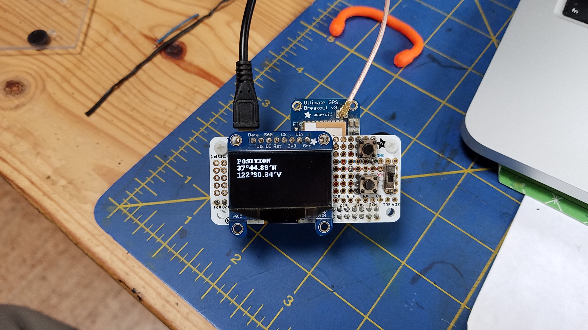 | 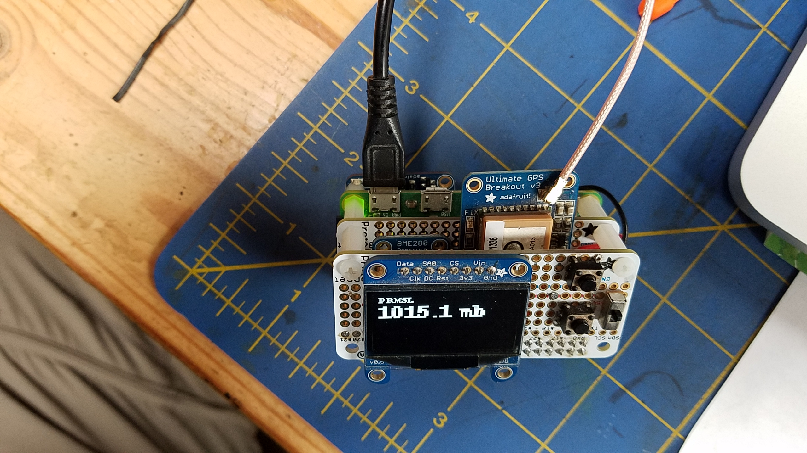 |
| Position                  | Position                | The 2 layers, apart |
| 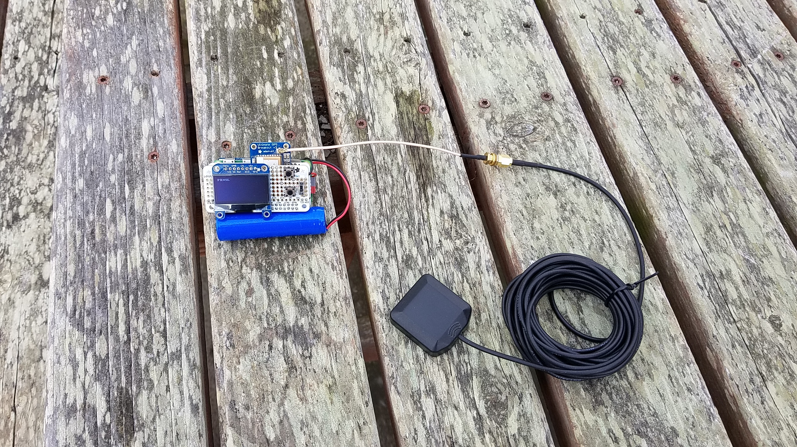 | 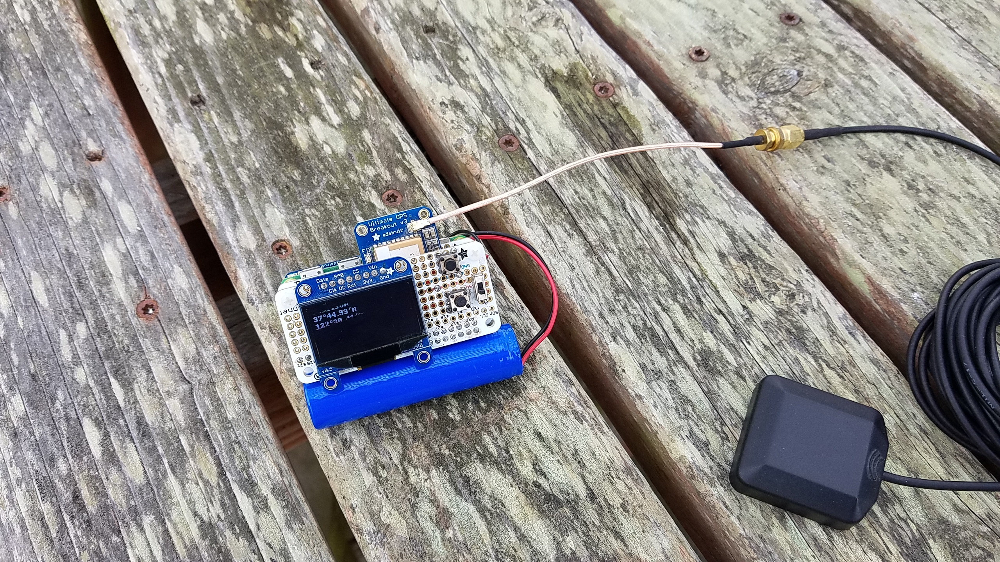 | 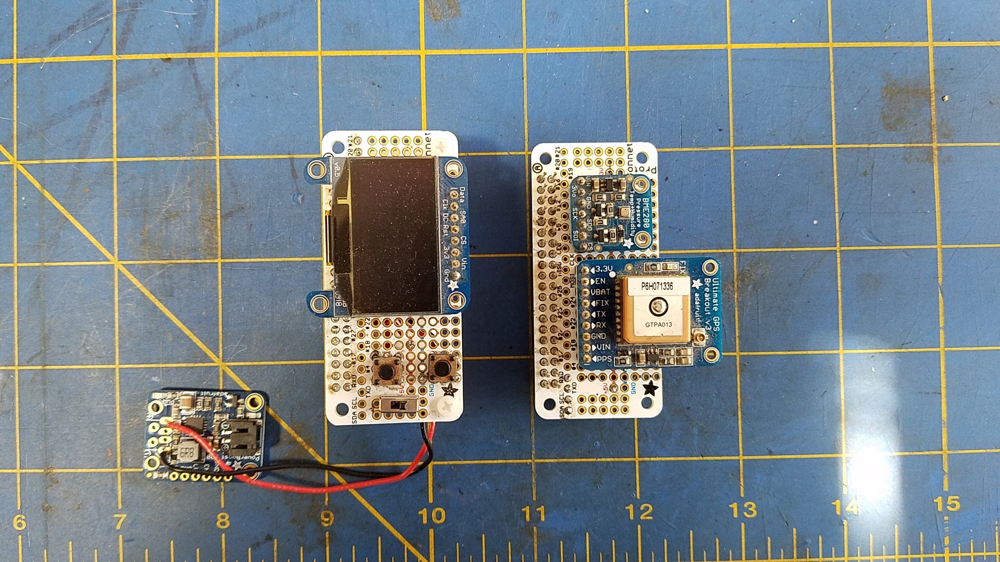 |
| One layer only, with a small 128x32 I2C oled screen (no buttons) | | |
| 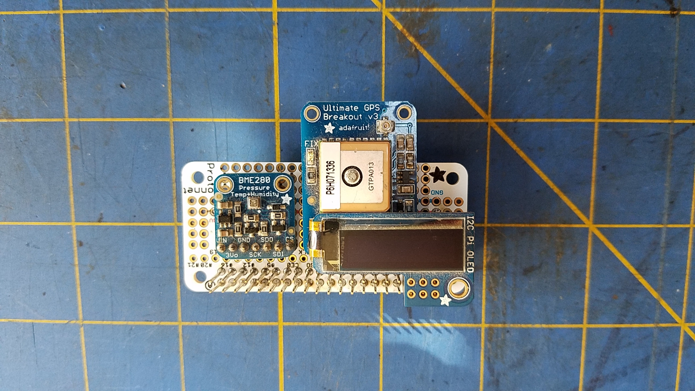 | | |

On top, it is powered by a USB Cable, it can also be powered by a LiPo battery (here 2200mAH).


### Screenshots

| NMEA Data | Local Menu | Local Menu, 2 |
|:---------:|:---------:|:---------:|
| 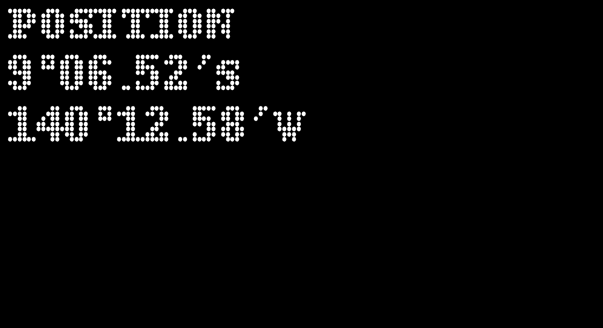 | 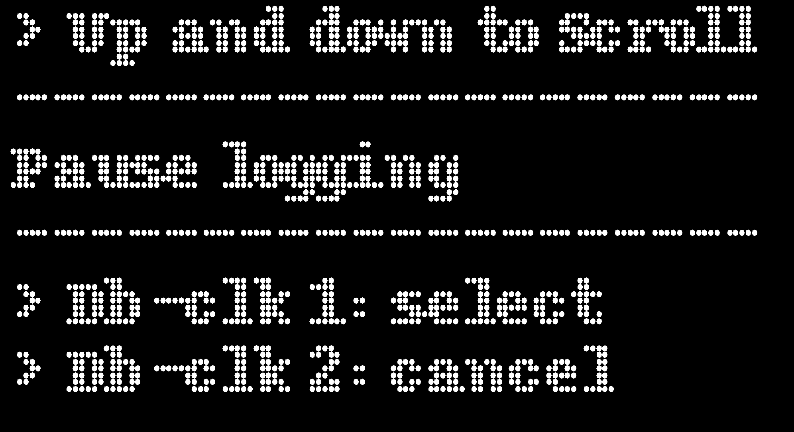 | 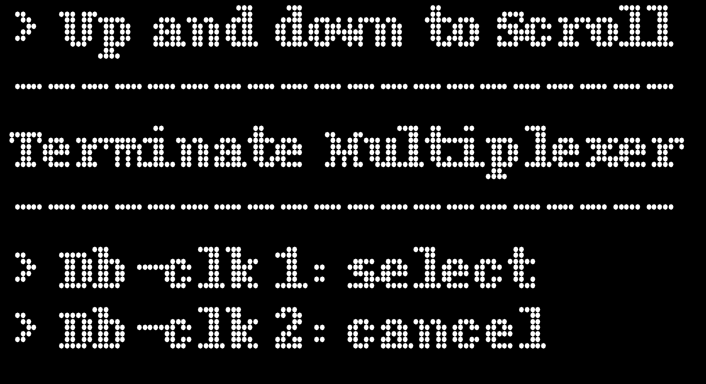 |
| Screen Saver (one dot blinking) | Complete Shutdown |
|  | 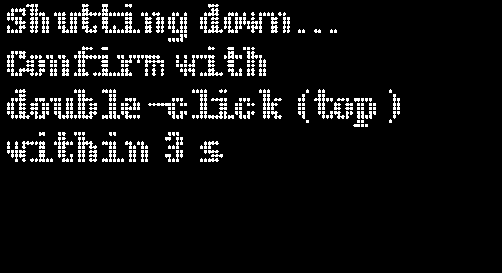 |

### Wiring
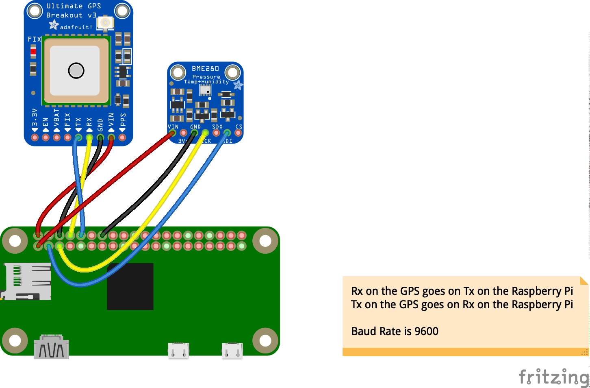

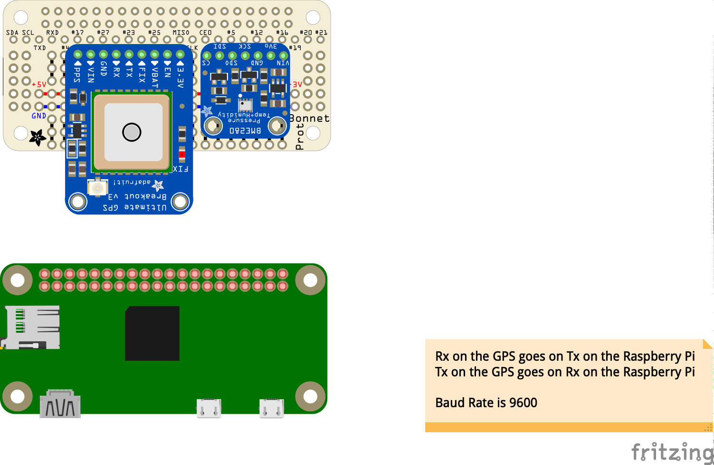

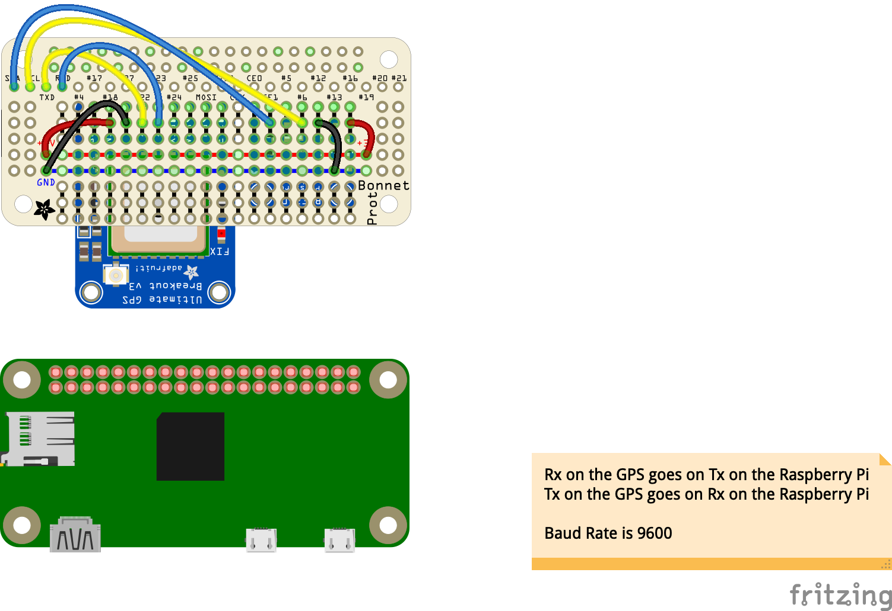

### Extras
- Cue-card for the UI (depends on your implementation):
```
Button-2 + LongClick on Button-1: Shutdown (confirm with double-click within 3 seconds) 
DoubleClick on Button-1: Show local menu                                                
DoubleClick on Button-2: Screen Saver mode. Any simple-click to resume.
```

> To grant serial port access to user `pi`:
> ```
> $ sudo usermod -a -G tty pi
> ```
> In case you use a USB GPS, if it shows up on port `/dev/ttyACM0` and you have trouble reading it,
> do a 
> ```
> $ sudo ln -s /dev/ttyACM0 /dev/ttyS80
> ```
> then read the port `/dev/ttyS80`.

### Configurations
#### [Raspberry Pi Zero W](https://www.raspberrypi.org/products/raspberry-pi-zero-w/)
RAM: 512 Mb
- **_Good for logging_**
- A bit challenging when acting as a server (Web and REST), too small.
- With a 2200mAH LiPo battery, alive between 1:00:31pm and 8:05:57pm (lifespan: 7:05:26)
- With a TCP forwarder, it's OK to reach it from another device, running OpenCPN for example.
- Not enough memory for the xsl/fop/pdf publications

#### [Raspberry Pi 3 A+](https://www.raspberrypi.org/products/raspberry-pi-3-model-a-plus/)
RAM: 512 Mb

- More powerful that the `Raspberry Pi Zero`, obviously, but still a bit challenged 
when displaying the web pages involving intensive REST requests.
- With a TCP forwarder, it's OK to reach it from another device, running OpenCPN for example.
- Not enough memory for the xsl/fop/pdf publications

> Use a [Perma-Proto Pi HAT](https://www.adafruit.com/product/2310)
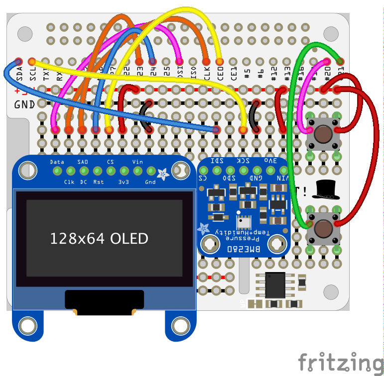
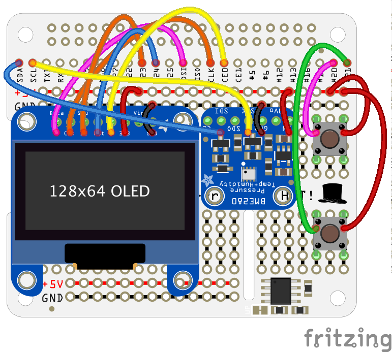

#### [Raspberry Pi 3 B](https://www.raspberrypi.org/products/raspberry-pi-3-model-b-plus/)
#### [Raspberry Pi 3 B+](https://www.raspberrypi.org/products/raspberry-pi-3-model-b-plus/)
RAM: 1Gb

- Still a bit challenged when displaying the web pages involving intensive REST requests.
- OK for almanac publication.
- With a TCP forwarder, it's OK to reach it from another device, running OpenCPN for example.

> Use a [Perma-Proto Pi HAT](https://www.adafruit.com/product/2310), same as above

#### Second Proto
Suitable for Raspberry Pi **A** and **B**. The GPS is external, using a USB port.

| In place | At work |
|:--------:|:-------:|
|  | 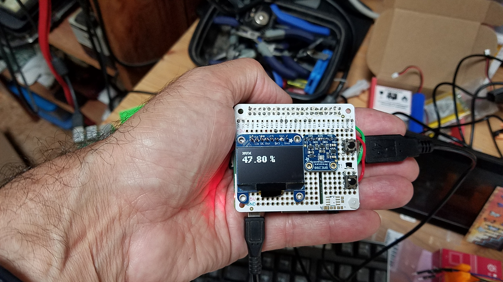 |
|  | |
In this configuration, the consumption is between 0.25 and 0.30 Amps.

> Bonus: [3D printed](https://github.com/OlivierLD/3DPrinting/tree/master/OpenSCAD/RPiA%2BLogger) enclosure (with pictures!).

> Note: When the Raspberry emits its own network, the file to look into to flip this feature on and off (when you need an update or upgrade, for example) is `/etc/network/interfaces`.

##### Raspberry Pi 4 B, with 4Gb of RAM
Easy: Perfect! 
All features available without having to wait.
- REST Server
- HTTP Server
- Publication of almanacs (Celestial and Tide)
- Sight reduction
- Logging
- Admin
- everything!

Emits its own network. Reachable from other devices (laptops, tablets, smart-phones, smart-watches)
through all available channels (ssh, vnc, tcp, http, etc).
No attached screen required, as ssh and VNC can do the job remotely.

Even OpenCPN seems to be running fine on this machine.

> _Note_: HDMI ports are `Micro-HDMI`, power supply requires a `USB-C`, and not a `Micro-B` as the other models.
>  

_Remember_: the U in USB stands for Universal...

> TODO: Evaluate power consumption, and the way it heats up.

### About Some GPS devices I tested
#### Adafruit Ultimate GPS, 66 channels
- $39.95 for the [breakout board](https://www.adafruit.com/product/746) 
- $14.95 for the [antenna](https://www.adafruit.com/product/960)
- $3.95 for the [connector](https://www.adafruit.com/product/851)

Not 100% reliable, "sometimes" stops reading, I don't know why...

#### GT-3731-44 (USB, 44 channels)
It is an old one, I got mine around 2004. Works fine, but the date (RMC) recently got off by 7168 days! Probably some kind of overflow... `7168 = 0x1C00`

#### [U-blox7, small USB dongle](https://www.amazon.com/Diymall-G-Mouse-Glonass-Raspberry-Aviation/dp/B00NWEEWW8/ref=sr_1_3?keywords=Stratux+Vk-162+Remote+Mount+USB+GPS&qid=1569081064&s=wireless&sr=1-3-catcorr), 56 channels.
$13.49. Works fine for me. From a laptop or a Raspberry Pi.

#### [Stratux Vk-162 Remote Mount USB GPS](https://www.amazon.com/Navigation-External-Receiver-Raspberry-Geekstory/dp/B078Y52FGQ/ref=sr_1_1?keywords=Stratux+Vk-162+Remote+Mount+USB+GPS&qid=1569081064&s=wireless&sr=1-1-catcorr), 50 channels.
$17.98. Works OK everywhere I tested it! 👍

## Lessons learned, conclusions
- For a fully featured Navigation Server, with Tide Computation, Almanacs publication, REST and Web Server (remotely accessible)
with real time astronomical data through REST and WebComponents, the Raspberry 3+ seems to be the minimal requirement.
- All other versions of the Raspberry Pi (including the Zero) are fitted to run the NMEA Multiplexer, with any Channels, Forwarders or Computers.
In this case, with a forward on TCP, the data it consumes, computes and forwards can be available remotely, 
for other programs (like OpenCPN, SeaWi, whatever understands TCP and NMEA) to consume them.  

### Examples

Raspberry Pi Zero W, 1 bonnet with a 128x64 oled screen and 2 push-buttons and one power swicth, a 4400 mAh LiPo battery,
all in a small waterproof case. The GPS is a U-blox7, small USB dongle.
Good for all terrain logging!

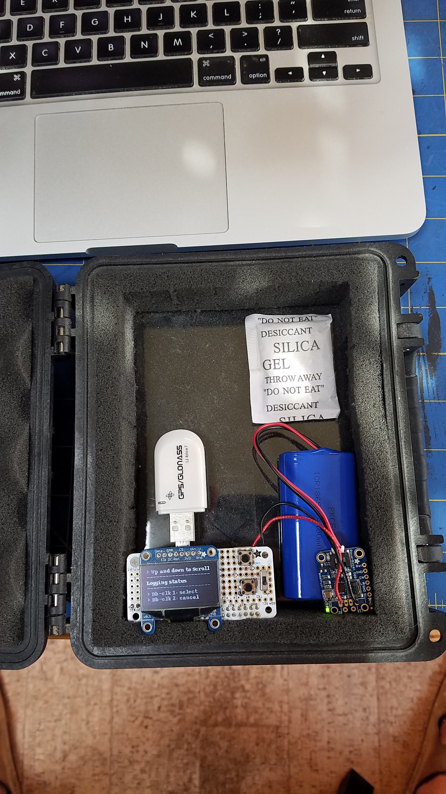

Start it with
```
 $ ./start-mux.sh
```

# TODO
- Describe the way to get to the log files, download, etc.
- Document Web UI: `runner.html`, `logMgmt.html`, etc. (maybe)
- Simulator for the buttons. &#9989; Done! And working great.
- 3D printed enclosure, to contain the Raspberry Pi, the 2 bonnets, and a LiPo battery.
- Go to screen saver mode after a given amount of time of inactivity. &#9989; Done.
- Compare several Raspberry Pi versions (Zero, A, B). &#9989; Done.
