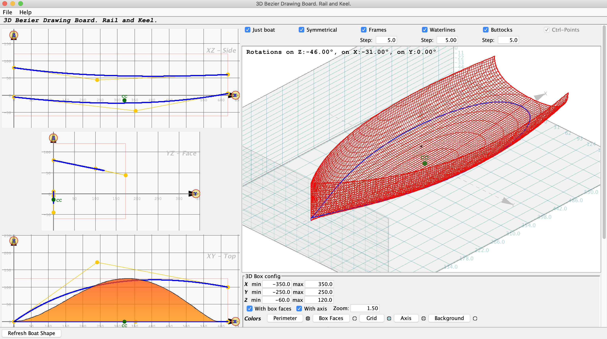

# Boat Design
> Work in Progress, a test.  
> Several (if not many) assumptions on options.

Based on the `Algebra` module, in this project.

- 3 2D views on the left
- A 3D view on the right

## Path #1
- Define Length, Width, Height
- Define a 3D bezier for the rail (on a 2D white board)
<!-- - Define a 2 or 3D bezier for the bow (on a 2D white board) -->
- Define a 2 or 3D bezier for the keel (on a 2D white board)
    - Tweak the way the frames are calculated
- See the result in 3D

Then do the hydrostatic calculations.

### Sep 2021
- Correlated points : the rail and the keel "define" the bow and transom:
  - front of the rail and top of the bow
  - front of the keel and bottom of the bow
  - back of the rail and transom's top
  - back of the keel and transom's bottom

## To fix (in progress)
- Transom and bow, when not vertical.
- Close horizontal and vertical cuts. Done ✅.

## TODO's
- Data to WebGL
- Data to STL, OpenSCAD, etc
  - Look into the [`polyhedron`](https://en.wikibooks.org/wiki/OpenSCAD_User_Manual/Primitive_Solids#polyhedron)
- Data to Processing (see PitchRoll.pde ...)

### Hints
- Main is in `boatdesign.ThreeViews`.
- Shape calculation done in `BoatBox3D`, look for `// Actual shape calculation takes place here.`

---
