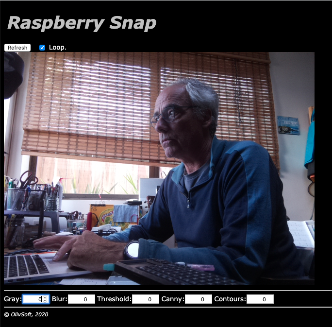
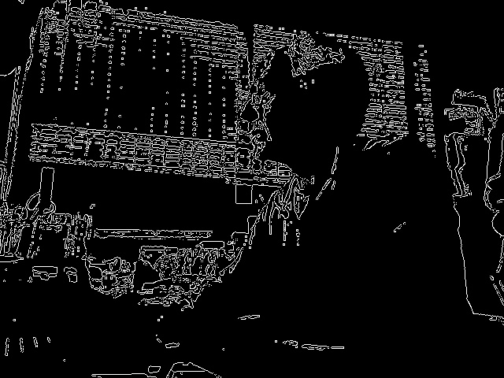

# Foundation for a WebCam Web Application
We'll be using the regular Raspberry Pi Camera Module (or a regular WebCam, with `fswebcam`).

We are talking about snapshots here, _not_ videos.

It _**is**_ possible to stream video from a Raspberry Pi, and it is easy.
See [Here](./VIDEO_STREAMING.md). 

### Tags and Keywords
`camera`, `images`, `raspistill`, `java`, `REST Server`, `no flickering`, `opencv`.

### Several components
- A Java thread (`image.snap.SnapSnapSnap`) that uses a camera (WebCam, PiCam, whatever, see the code to get the right one) to take pictures at a given time interval
- A REST server that goes along with it, allowing an HTTP access to the picture taken above
- A small Web App that pings the REST server, and display the last picture in a web page, refreshable at will (automatically or manually).

And optionally
- OpenCV

### Compile and run
> Requires OpenCV to be available where compilation happens (see below).

On the Pi:
```
 $ ../../gradlew clean shadowJar
 $ ../../gradlew clean shadowJar run
```
or
```
 $ ../../gradlew clean shadowJar
 $ ./server.sh
``` 
From any browser, on any machine on the same network as the Pi: 
```
 http://[the-pi-address]:1234/web/index.html
``` 
The snapshot is updated on a regular base, and stored in a directory known by the 
REST/HTTP server, and thus reachable through its URL.



### OpenCV on the Raspberry Pi?
OpenCV can pave the way for Artificial Intelligence and Image Recognition. 
We could certainly use its features here.

Installing OpenCV is not snappy, but it is not too difficult.

- Instructions are available at <https://opencv-java-tutorials.readthedocs.io/en/latest/01-installing-opencv-for-java.html#introduction-to-opencv-for-java>
- Also, worth a look: <https://www.learnopencv.com/install-opencv-4-on-raspberry-pi/>
- And <https://gist.github.com/ivanursul/146b3474a7f3449ec70729f5c7f946ee>

Some differences below with the scripts provided above...

Also see [this project](https://github.com/OlivierLD/oliv-ai/tree/master/opencv).

### Other Systems
See <https://opencv-java-tutorials.readthedocs.io/en/latest/01-installing-opencv-for-java.html>.

#### April-30, 2020.
Raspbian Buster comes with a JDK 11.
```
$ export JAVA_HOME=/usr/lib/jvm/java-11-openjdk-armhf
```
We will need `cmake`, make sure you have it available:
```
$ which cmake
```
If missing, install it:
```
sudo apt-get install build-essential cmake ant
```

- Download the last sources from <https://opencv.org/releases/>
  - Can be a `wget https://github.com/opencv/opencv/archive/4.3.0.zip`
  - `mv 4.3.0.zip opencv-4.3.0.zip`
- `unzip opencv-4.3.0.zip`
- `cd opencv-4.3.0`
- `mkdir build`
- `cd build`
- Make it (this one takes time, hours...):
```
cmake -D CMAKE_BUILD_TYPE=RELEASE \
      -D WITH_LIBV4L=ON \
      -D WITH_OPENCL=OFF \
      -D BUILD_PERF_TESTS=OFF \
      -D BUILD_SHARED_LIBS=OFF \
      -D JAVA_INCLUDE_PATH=$JAVA_HOME/include \
      -D JAVA_AWT_LIBRARY=$JAVA_HOME/lib/libawt.so \
      -D JAVA_JVM_LIBRARY=$JAVA_HOME/lib/server/libjvm.so \
      -D CMAKE_INSTALL_PREFIX=/usr/local ..
```
- `sudo make`
- `sudo make install`

Quick test, from python
```
$ python3

>>> import cv2
>>> print(cv2.__version__)
4.3.0
>>>
```
Some location(s) to keep track of:
```
$ find /usr/local -name '*opencv*.jar' -exec ls -lisah {} \;
1075459 640K -rw-r--r-- 1 root root 639K Apr 30 10:09 /usr/local/share/java/opencv4/opencv-430.jar
```
- `/usr/local/share/java/opencv4/opencv-430.jar` will be used for the Java Classpath 
- `/usr/local/share/java/opencv4` will be used for the Java `-Djava.library.path`, as it contains a required system lib.
```
ll /usr/local/share/java/opencv4/
total 20M
1075457 4.0K drwxr-xr-x 2 root root 4.0K Apr 30 10:21 .
1075456 4.0K drwxr-xr-x 3 root root 4.0K Apr 30 10:21 ..
1075458  20M -rw-r--r-- 1 root root  20M Apr 30 10:11 libopencv_java430.so
1075459 640K -rw-r--r-- 1 root root 639K Apr 30 10:09 opencv-430.jar
pi@rpi-buster:~/opencv-4.3.0/build $ 
``` 

JavaFX was removed from JDK 11, it's to be referred to as a module...

In order not to introduce un-necessary complexity, we will not be using it here.

For JavaFX, see [this](https://stackoverflow.com/questions/38359076/how-can-i-get-javafx-working-on-raspberry-pi-3).
 
### REST
When the server starts, no snap-thread (the one taking snapshots) is running.
It needs to be explicitly started.

Here are some available REST end-points, reachable from any REST client (`curl`, PostMan, an XMLHttpRequest in you browser, etc):
- Get current config and status
```
$ curl -X GET http://192.168.42.15:1234/snap/snap-status | jq
  % Total    % Received % Xferd  Average Speed   Time    Time     Time  Current
                                 Dload  Upload   Total   Spent    Left  Speed
100   115  100   115    0     0    737      0 --:--:-- --:--:-- --:--:--   737
{
  "rot": 180,
  "width": 640,
  "height": 480,
  "wait": 1000,
  "snapName": "./web/snap.jpg",
  "threadRunning": true,
  "state": "WAITING"
}
```
- `rot`, `width`, `height` follow the specs of `raspistill` (WxH ratio does not need to be constant). 
- Set config
```
$ curl -X POST http://192.168.42.15:1234/snap/commands/config \
        -H "camera-rot: 180" \
        -H "camera-width: 480" \
        -H "camera-height: 320" | jq 
    % Total    % Received % Xferd  Average Speed   Time    Time     Time  Current
                                   Dload  Upload   Total   Spent    Left  Speed
  100   115  100   115    0     0    912      0 --:--:-- --:--:-- --:--:--   920
  {
    "rot": 180,
    "width": 480,
    "height": 320,
    "wait": 1000,
    "snapName": "./web/snap.jpg",
    "threadRunning": true,
    "state": "WAITING"
  }
```
- Start (with config)
```
$ curl -X POST http://192.168.42.15:1234/snap/commands/start \
        -H "camera-rot: 180" \
        -H "camera-width: 480" \
        -H "camera-height: 320" | jq 
    % Total    % Received % Xferd  Average Speed   Time    Time     Time  Current
                                   Dload  Upload   Total   Spent    Left  Speed
  100   115  100   115    0     0    912      0 --:--:-- --:--:-- --:--:--   920
  {
    "rot": 180,
    "width": 480,
    "height": 320,
    "wait": 1000,
    "snapName": "./web/snap.jpg",
    "threadRunning": true,
    "state": "WAITING"
  }
```
- Stop snap thread
```
$ curl -X POST http://192.168.42.15:1234/snap/commands/stop | jq 
    % Total    % Received % Xferd  Average Speed   Time    Time     Time  Current
                                   Dload  Upload   Total   Spent    Left  Speed
  100   115  100   115    0     0    864      0 --:--:-- --:--:-- --:--:--   864
  {
    "rot": 180,
    "width": 640,
    "height": 320,
    "wait": 1000,
    "snapName": "./web/snap.jpg",
    "threadRunning": true,
    "state": "TERMINATED"
  }

```

#### OpenCV 
We have added some support for some query-string parameters to the REST resource we use 
to get to the image.
It can be reworked _on the server_ before being reached from the client (browser) through its URL, just like before.

Those parameters can be driven from the web page displayed above, with the fields labeled 
`Gray`, `Blur`, `Threshold`, `Canny`, and `Contours`. The number the fields contain
refers to the order in which the corresponding transformation is applied to the image.
`0` means no transformation, values greater than 0 must be unique (do not give the same number to several transformations). 

Here are a couple of examples:

| Raw                             | Grayed                               |
|:-------------------------------:|:------------------------------------:|
|  |  |
| Grayed and Blurred              | Grayed & Threshold                   |
|  |  |
| Threshold and Canny             | Color & Threshold                   |
|  |  |

... More to come!

### A warning
It seems that `raspistill` can have some problems with the 64-bit OS on the Raspberry Pi...
But `fswebcam` works good. This is why there are several "snapshot command" options, `raspistill` being the default.

See in the code how system variables `-Dsnapshot.command=FSWEBCAM` and related are managed.
There are some sample in `server.sh` as well. 

#### TODO Next
- a zoom
- fix the `contours` option...
- code for a stop-motion app

## Summary
To run this small app:
- Start the server (`./server.sh` on the Raspberry Pi)
- Start the Snap Thread (through REST - `curl -X POST http://raspi-addr:1234/snap/commands/start -H "camera-rot: 0" -H "camera-width: 1280" -H "camera-height: 720"` )
- Reach the app page in the browser, and choose the options.

---
