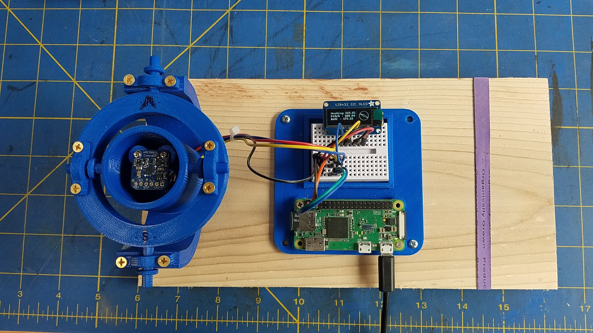
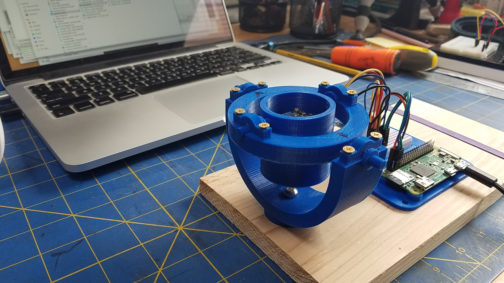
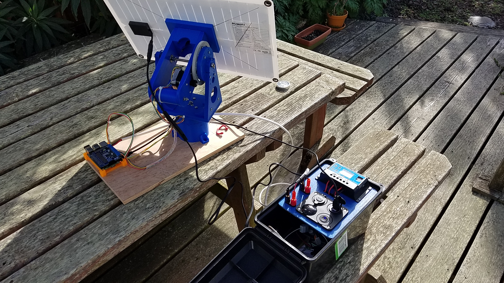
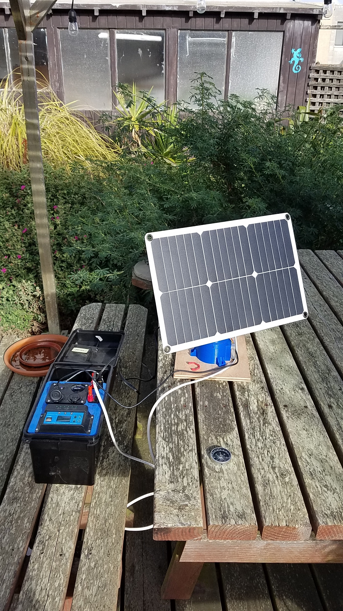

# SunFlower Versions 2.0 a and b
 

The goal of this project is to _**automatically**_ orient a solar panel so it faces the sun as long as it is in the sky.

---
> _Preamble_:
> 
> I started from  [this instructable](https://www.instructables.com/id/Ammo-Can-Solar-Power-Supply/), showing how to load a small (15Ah) portable battery
> with a small solar panel.
>
> Obviously, orienting the panel so it faces the Sun improves the efficiency, a lot.
>
> The hardware described and used here can be 3D printed with the files generated by 
> the projects featured [here](https://github.com/OlivierLD/3DPrinting/tree/master/OpenSCAD/SolarPanelStand) and [here](https://github.com/OlivierLD/3DPrinting/tree/master/OpenSCAD/SolarPanelStand.v3). 
---

- The [first version](../SunFlower) used micro-servos to orient a small solar panel.
- Here we want to deal with bigger panels, this will require the usage of bigger motors, like stepper-motors.
- The required hardware is described in a [separate project](https://github.com/OlivierLD/3DPrinting/tree/master/OpenSCAD/SolarPanelStand).
- Stepper motors will be driven by an [Adafruit Motor Hat](https://www.adafruit.com/product/2348).
- Some code to look at is in [this folder](../SteppersPlayground), to play with the different options
of the stepper motors...

### Wiring


> Note: It is also possible to power the `Motor Hat` from a USB port of the Raspberry Pi.
> This way, only one power supply is required, it's the usual 5v for the Raspberry Pi. 

### Standard output
Simple standard output, just run `run.sh`.

#### With the `calibration` option
Takes its input from the CLI, not from the Astro Thread. Use it to calibrate the device,
to make sure it is working as expected.
```
$ ./run.sh 
Starting SunFlowerDriver
------------------------------ C A L I B R A T I O N ----------------------------
To change the Azimuth (Z) value, enter 'Z=12.34', the value goes from 0 to 360.
To change the Elevation (E) value, enter 'E=23.45', the values goes from 0 to 90.
Enter 'PARK' to park the device.
Enter 'Q' to quit.
---------------------------------------------------------------------------------
Current status: Z=180.00, Elev.=90.00
> z=213
Current status: Z=213.00, Elev.=90.00
> 
. . .
``` 
 
### ANSI Console output
Run `sunflower.main.ConsoleMain`, from the script `console.sh`.
```
- Positions -
+------+----------------------------+------+-----+
|      | Date                       | Z    |Elev |
+------+----------------------------+------+-----+
|Sun   |Tue Feb 04 14:37:42 PST 2020|216.67|27.60|
+------+----------------------------+------+-----+
|Device|Tue Feb 04 14:37:42 PST 2020|216.65|27.60|
+------+----------------------------+------+-----+
- Movements -
+-----+----------------------------+------+------+------+
|     | Date                       |from  |to    |diff  |
+-----+----------------------------+------+------+------+
|Elev.|Tue Feb 04 14:37:41 PST 2020| 28.10| 27.60|  0.50|
+-----+----------------------------+------+------+------+
|Z    |Tue Feb 04 14:37:35 PST 2020|216.15|216.65|  0.50|
+-----+----------------------------+------+------+------+
- Status -
+----------------------------+----------------------------------------------------------------+
| Date                       | Info                                                           |
+----------------------------+----------------------------------------------------------------+
|Tue Feb 04 14:33:22 PST 2020|Device Parked                                                   |
+----------------------------+----------------------------------------------------------------+
|Tue Feb 04 14:37:41 PST 2020|Move (2 steps) completed in 0.020 sec                           |
+----------------------------+----------------------------------------------------------------+
|Tue Feb 04 14:37:35 PST 2020|Move (11 steps) completed in 0.111 sec                          |
+----------------------------+----------------------------------------------------------------+
Hit Ctrl-C to stop the program

```
### HTTP Server (WiP) 
Same as above, but no UI in the console. Data are accessible through REST requests.
See `server.sh` for details.
```
$ ./server.sh 
  >>> Running on port 8989
  Starting Program
  Hit Ctrl-C to stop the SunFlowerDriver program
  1,581,012,167,407 - Port open: 8989
  1,581,012,167,409 - http.HTTPServer now accepting requests

. . .
```
or
```
$ nohup ./server.sh > sf.log &
```
and to stop it:
```
$ ./killsf.sh
```

Example (early preview):
```
$ curl -X GET http://localhost:8989/sf/status
```
would produce
```json
{
    "CELESTIAL_DATA": {
        "date": "Feb 6, 2020, 10:26:30 AM",
        "epoch": 1581013590245,
        "azimuth": 146.94544209045705,
        "elevation": 29.916649314162267
    },
    "MOVING_AZIMUTH_START": {
        "date": "Feb 6, 2020, 10:26:15 AM",
        "epoch": 1581013575179,
        "deviceAzimuth": 180.0,
        "sunAzimuth": 146.88339752645817
    },
    "DEVICE_DATA": {
        "date": "Feb 6, 2020, 10:26:30 AM",
        "epoch": 1581013590245,
        "azimuth": 146.88339752645817,
        "elevation": 29.889625427506264
    },
    "DEVICE_INFO": {
        "date": "Feb 6, 2020, 10:26:14 AM",
        "epoch": 1581013574113,
        "message": "Device was parked"
    },
    "MOVING_ELEVATION_START": {
        "date": "Feb 6, 2020, 10:26:15 AM",
        "epoch": 1581013575183,
        "deviceElevation": 90.0,
        "sunElevation": 29.889625427506264
    }
}
```
### Date Simulation
The default date used for Celestial Computation is the current system date.

For development or demo, there is a possibility to simulate this date.

To simulate the date, you need to provide three system variables:
- `-Ddate.simulation=true`. default `false`
- `-Dstart.date.simulation=2020-03-06T20:00:00`. Duration Format. no default. Must be provided if `date.simulation` is `true`.
- `-Dincrement.per.second=600`. In seconds, no default, minimum `1`. Must be provided if `date.simulation` is `true`. Here - for example, this will increment the date by 10 minutes (600 seconds) every second.

### Heading input
If the device has to be carried by a vehicle in motion, we need to have the heading of the device.

Small magnetometers like an `HMC5883L` or an `LSM303` can do the job.
> _Note_: Those magnetometers **do require** a calibration, See [here](../../I2C.SPI/lsm303.calibration/README.md) for details. 
 
But the magnetometers can go crazy if they're too close to a magnet, and stepper motors heavily use magnets.

Having the magnetometer too close to the stepper motors is **not** a good idea.

This is where we use the `NMEA.multiplexer` project (part of this repo). We have another Raspberry Pi (a Raspberry Pi Zero does the job)
with a magnetometer attached to it, running the `NMEA.multiplexer`.
The `NMEA.multiplexer` can also serve as a REST server, storing NMEA data in a cache, queryable from a REST client.

|       HMC5883L                 |     HMC5883L                   |
|:------------------------------:|:------------------------------:|
|  |  | 

> `STL` files for the gimbal can be found [here](https://github.com/OlivierLD/3DPrinting/tree/master/OpenSCAD/Gimbal).

And this is what we do here, we added System properties:
```bash
JAVA_OPTS="$JAVA_OPTS -Dping.nmea.server=true"
JAVA_OPTS="$JAVA_OPTS -Dnmea.server.base.url=http://192.168.42.20:9991"
``` 
This tells the code driving the device to ping the NMEA server every second to get the heading from it.
In this case, it will do a REST request like 
```
GET http://192.168.42.20:9991/mux/cache
``` 
returning a `json` payload like
```json
{
    "NMEA_AS_IS": {
        "HDM": "$IIHDM,172,M*38",
        "XDR": "$IIXDR,A,178,D,PTCH,A,-160,D,ROLL*78"
    },
    "Damping": 1,
    "Current calculated with damping": {},
    "HDG Offset": 0.0,
    "Default Declination": {
        "angle": 14.0
    },
    "Deviation file name": "zero-deviation.csv",
    "HDG mag.": {
        "angle": 172.0
    },
    "BSP Factor": 1.0,
    "Max Leeway": 0.0,
    "AWS Factor": 1.0,
    "AWA Offset": 0.0,
    "NMEA": "$IIXDR,A,178,D,PTCH,A,-160,D,ROLL*78"
}
```
from which the heading is obtained, and used to calculate the azimuthal orientation of the panel. 

### The Device
The soft of this project is designed to drive [this device](https://github.com/OlivierLD/3DPrinting/blob/master/OpenSCAD/SolarPanelStand/stl/the.full.stand.stuck.stl).
Its 3D printing construction is detailed in [its repo](https://github.com/OlivierLD/3DPrinting/tree/master/OpenSCAD/SolarPanelStand).

#### The _real_ device
Here is a animation - stop motion - of the real device (first prototype), on 231 minutes, starting before noon, ending after. Event if the sky was obviously not clear, 
orienting the panel does make a difference on the load. The first frames are too bright, it **was** sunny... 😎


In this animation - just to validate the concept, the Raspberry Pi driving the device, and the one taking the snapshots were both powered by the battery fed by the solar panel.

### Some pictures

| At work                             | At work                           |
|:-----------------------------------:|:---------------------------------:|
|    |  |
|  |                                   |

## TODO
- An ANSI Console. &#9989; Done (...ish).
- A Web Console. WiP.
    - REST and/or WebSockets?
- A utility, to manually/interactively orient the panel from user's inputs. &#9989; Done.
    

---
