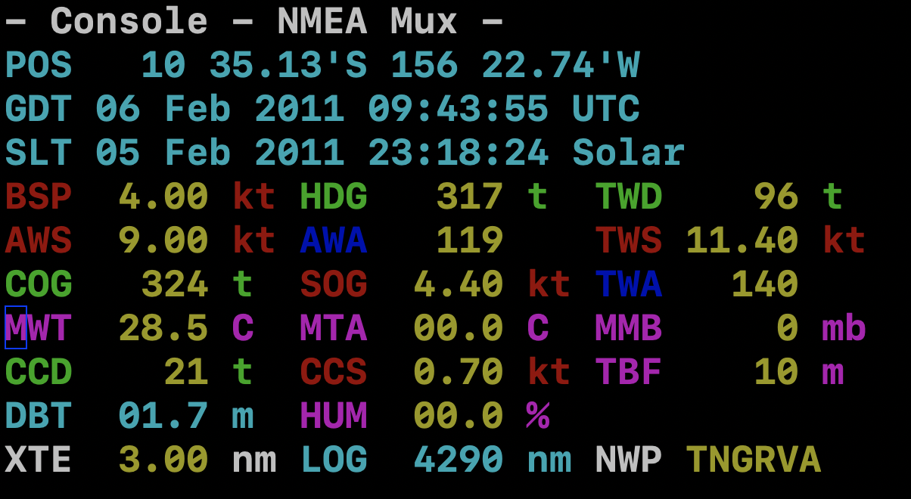
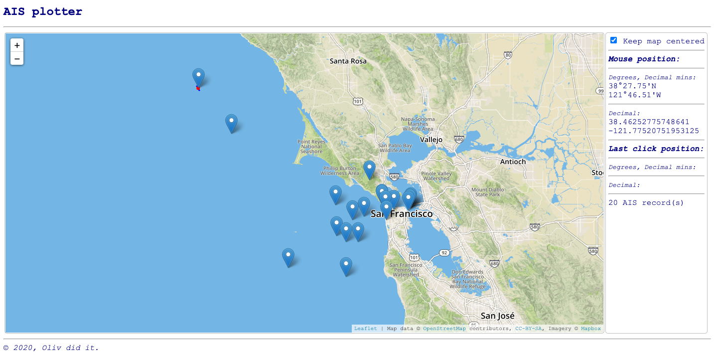
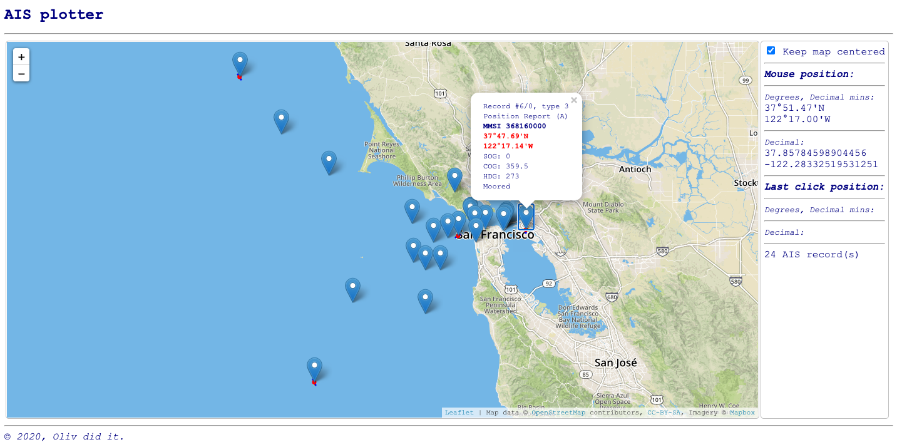
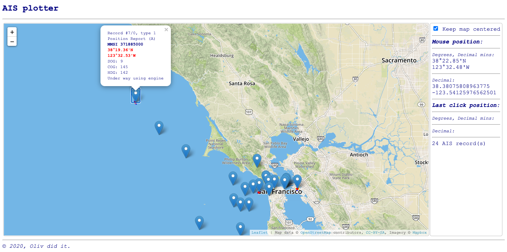
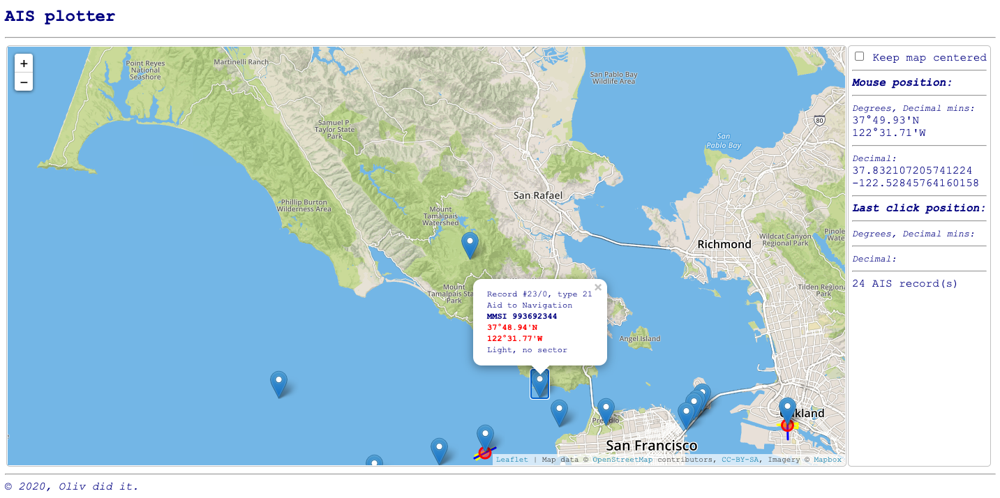

# Navigation Server
#### Prolongation/Extension of the NMEA-multiplexer

An illustration of the way to gather or aggregate several REST Services all in one place.
This project is an extension/prolongation of the [NMEA Multiplexer](https://github.com/OlivierLD/raspberry-pi4j-samples/blob/master/NMEA-multiplexer/README.md).

It uses:
- [Tide](https://github.com/OlivierLD/raspberry-pi4j-samples/blob/master/RESTTideEngine/README.md) REST Service
- [Astro](https://github.com/OlivierLD/raspberry-pi4j-samples/tree/master/RESTNauticalAlmanac) REST Service
- [NMEA Multiplexer](https://github.com/OlivierLD/raspberry-pi4j-samples/blob/master/NMEA-multiplexer/README.md) REST Service
- ... and the list keeps growing (see in `navrest.NavServer.java` how to add a `RequestManager`).

In addition, I'll be attempting to implement the features of the Weather Wizard (another project I own, in Java and Swing, that can superimpose different heterogeneous documents on the same chart, like Faxes, GRIBS, routing results, etc.). This part involves the
`Img` REST Service, found in the [`RESTImageProcessor`](https://github.com/OlivierLD/raspberry-pi4j-samples/tree/master/RESTImageProcessor) project, and the routing features, found in the [`RESTRouting`](https://github.com/OlivierLD/raspberry-pi4j-samples/blob/master/RESTRouting/README.md) project.

### Rationale

Even small boards like the Raspberry Pi can swallow heavy data computing.

Graphical User Interfaces (GUIs) are not falling in the same bucket, they can be very demanding, special processors (called GPU, for Graphical Processing Units) have been developed for GUI-demanding applications (like video-games...),
as regular CPUs (Computing Processing Units) are not fitted for those too GUI demanding situations.

That is why we will stick to the Command Line Interface (CLI) on the Raspberry Pi. You can still start the Raspian Graphical Desktop, but this will never be required.

So, the idea here is _not_ to display _any_ Graphical User Interface (GUI) on the Raspberry Pi, where the server is running.
The GUI is dedicated to `HTML5`, `JS` and `CSS3`, rendered in the browser of any device connected to the Raspberry Pi's network (laptop, tablet, smart-phone, smart-watch, etc).

> As a matter of fact, for now (Aug-2018), whatever in mentioned below runs *fine* on a $10 `Raspberry Pi Zero W`.
> And this does not prevent the Raspberry Pi from serving web pages taking care of the GUI. The Raspberry Pi runs 24x7, and you connect to it
> from a GUI-savvy device to see your data in a good looking User Interface (UI).

An application like `OpenCPN` seems (to me) too demanding for the Raspberry Pi. Same for all `Swing` applications
developed in Java. And actually, this is a general trend in this area, languages like Java are clearly moving to the back-end side of the story.
Java applets are being de-supported in more and more browsers, HTML and connected technologies keep improving
their graphical capabilities (see [WebGL](http://learningwebgl.com/blog/), really [amazing](http://arodic.github.io/p/jellyfish/)).

For inspiration, check out sites like [CodePen](https://codepen.io/)...

> Just to nail it down: we've all used Integrated Development Environments (IDE), considering that this is (or was) where
> client side processing capabilities were needed.
> Well, think again, and look at what [Cloud9](http://c9.io/) is capable of...

Learning how to use graphical libraries (like `Swing`, `JavaFX`, and others) is not an easy task,
it is demanding, it is long, and there is no standard way to do it. For example, moving from `Swing` to `JavaFX` or `SWT` pretty much requires
a full re-write of your application.

I'd rather spend time learning how use HTML5's canvases, or WebGL.

> This project has three distinct aspects:
> - Pure computing, serving requests like "give me the coordinates of the Sun **now**"
> - REST services written in Java, running on the Raspberry Pi (or any other machine), those _services_ know how to translate the above into what's expected below.
> - Web pages, to be rendered on any device that can reach the Raspberry Pi's network. Those pages may very well invoke the REST services mentioned one step above, the get to the data mentioned two steps above.

The sample web pages presented below are relying on HTML5 and CSS3. The JavaScript code will be migrated to ES6.

#### Three domains
This clearly divides the problem to address in several distinct domains:
- Back end computation, returning the raw data to render as some Java object. Also known as **the model**.
- Front end rendering, consuming the data provided by the back end to display them in a Graphical User Interface (GUI). Also known as **the view**.
- The broker (the glue) in-between is relying on the HTTP protocol, transforming the back-end data into a format known by the front-end, like `json` or `XML` (we'll use `json` here, the power of `XML` is not required, except in the almanacs publishing part). Exposes its features as REST services. Also known as **the controller**.

This is what's called an **Model-View-Controller (MVC)** architecture.

This allows pretty much _any_ network-aware device to connect to the Local Area Network (LAN)
created by the Raspberry Pi (or any machine the server runs on) to connect to it and consume the data it produces.

The way to go for the front end (view) is - at least for now - quite obvious, it is the combination of HTML5, CSS3, and JavaScript.
Consuming REST services can be done from many frameworks, here we'll use `jQuery`, for its `Promise` (aka `Deferred`) features.
> _Summer 2018_: I'll be moving away from `JQuery Deferred`, `EcmaScript6` comes with `Promises` that work fine. `JQuery` is a great tool, but not required here any more.

For the back end (model and controller), my current choice would be to go for a Java Virtual Machine (JVM) supported language, like Java (this is by far not the only JVM-supported language, see Scala, Groovy, Clojure...), mostly for portability,
re-usability and extensibility reasons. I have several other projects (not necessarily dedicated to the Raspberry Pi) writen in Java; a `jar` (**J**ava **AR**chive) generated from those projects can be part of **any**
Raspberry Pi project as long as it runs on a JVM.

But other options could be considered, the most prominent one being probably `nodejs`. This could be quite interesting too, as the same language could be used to write the
Front End _and_ the Back End. The [Pi.js](https://github.com/OlivierLD/node.pi) project illustrates how to deal with sensors on a Raspberry Pi, using JavaScript, on Node-JS.

Something to think about 😜 !

Also, the emergence of container techniques like `Docker` opens the door to other languages, like `Golang`. What's said above about re-usability remains, but this might also be something to take a look at. And `Docker` runs just fine on the Raspberry Pi.

Anyway! For now and until further notice, the back-end is running on a JVM.

## NMEA-multiplexer, plus REST
### Flexibility and modularity

_To summarize_, this project runs the `NMEA-multiplexer`.

The `NMEA-multiplexer` can
- get its input from a variety of channels
    - Serial ports
    - TCP ports
    - Custom sensors
    - and much more
- compute extra data
    - like current, very useful
- rebroadcast data on a variety of channels (called forwarders)
    - like above
- wrap/embed a REST-enabled HTTP Server
    - to serve static HTML pages or integrate several REST `RequestManager`s (see examples above).
    > _Note_: The HTTP server we talk about here is a tiny one, written in Java (but **not** JEE compliant, by far), that runs fine on small boards like the Raspberry Pi. It is part of this project too.

As a REST interface is available, pretty much any component with WiFi capabilities can reach the server.
This include
- Web pages (potentially hosted by the REST/HTTP server itself)
    - accessed by laptops, tablets, smart-phones
- Smart watches (REST enabled, as they all are)
- `ESP8266` devices
- etc...

Again, no UI will **ever** be rendered on/by the server (here the Raspberry Pi, that may serve web pages, though).
But the actual UI rendering will **always** be done on a REST or HTTP client, in the (incomplete) list mentioned above.


You can see the `RequestManager`s as components handling extra REST requests. For example:
- a request `GET /mux/cache` will be handled by the `NMEA-multiplexer`
- a request like `POST /tide/tide-stations/Ocean%20Beach/wh` will be handled by the `Tide REST Request Manager`
- a request like `POST /astro/sun-moon-dec-alt` will be managed by the `Astro REST Request Manager`
- other requests could be considered (see the HTTP server's code to understand how) as static HTTP requests, and render the resources of the `web` (or any other name you can choose) folder for that.
  > Note: a `static` web document can very well perform `dynamic` REST requests, bringing live data to the web interface.

The `NMEA-multiplexer` embedded in the `REST/HTTP Server` gathers data from NMEA station(s), sensors, other channels, possibly logs them, computes and process other data, and can feed other programs (`OpenCPN`, `SeaWi`, etc) through the channel(s) of your choice.

For now (Dec 2018), the Web pages we use here are using HTML5, CSS3, JavaScript (ES5 & 6), WebComponents...
Later, we might as well provide some WebGL examples.

This way, you can "compose" the Navigation Server you need, by adding or removing REST Request Managers, adding or removing channels or forwarders, adding or removing computers, adding or removing web resources, most (if not all) of the components are extendable.

The module `NMEA.mux.WebUI` in this project is a playground for this kind of custom compositions.

## Try it
Build it:
```bash
 $ ../gradlew [--no-daemon] shadowJar
```

Then run the server
```bash
 $ cd launchers
 $ ./runNavServer.sh
```

Finally, use `Postman`, any `REST` client, or your browser, and reach
```
 GET http://localhost:9999/oplist
```

You will see it displays operations from three services.

Another option is to start this script:
```
 $ cd launchers
 $ ./demoLauncher.sh
```
This latter one will start the server and open the appropriate Web UI, from a console interface like this:
```
+-----------------------------------------------------------------------------------------+
|               N A V   S E R V E R - D E M O   L A U N C H E R  🚀                       |
+-----------------------------------------------------------------------------------------+
|  P. Launch proxy CLI, to visualize HTTP & REST traffic                                  |
| PG. Launch proxy GUI, to visualize HTTP & REST traffic                                  |
+-----------------------------------------------------------------------------------------+
|  1. Time simulated by a ZDA generator, HTTP Server, rich Web UI. Does not require a GPS |
|  2. Interactive Time (user-set), HTTP Server, rich Web UI. Does not require a GPS       |
|  3. Home Weather Station data                                                           |
|  4. With GPS and NMEA data, waits for the RMC sentence to be active to begin logging    |
|  ... TODO: more.                                                                        |
| 10. Full Nav Server Home Page. NMEA, Tides, Weather Wizard, Almanacs, etc               |
+-----------------------------------------------------------------------------------------+
|  S. Show NavServer process(es)                                                          |
| SP. Show proxy process(es)                                                              |
+-----------------------------------------------------------------------------------------+
|  Q. Quit                                                                                |
+-----------------------------------------------------------------------------------------+
 ==> You choose:
```

> About the proxies, see the note [here](../common-utils/README.md#http-server-wip).

## Use it

The web pages mentioned below are provided _as examples_ of the way to consume the REST services provided on the Raspberry Pi.
The snapshots might be a little obsolete, this iks a work in progress, constantly evolving.
But this will give you an idea.

From _any_ device (laptop, tablet, smart-phone or smart-watch) that can run a browser, reach this url:
```
 http://[host]:9999/web/index.html
```
> `[host]` is the name or IP of the machine the server runs on.

_Your browser needs to support `HTML5` and `CSS3`, but nowadays, less and less browsers do not._

Then you are able to:
- See the Navigation Console
- Publish Nautical Almanacs
- Visualize Tide Curves
- etc.


The menu is accessible from the hamburger at the top left.

In addition, as we are using the `NMEA Multiplexer` (see this project), you can read pretty much any
NMEA data source, compute and transform then, and rebroadcast then on any channel you like, to enable other devices and programs
to read them (`OpenCPN`, `SignalK`, etc) .


NMEA Console. The displays (night theme).


Evaluation of the current, instantaneous, 30 seconds.


Evaluation of the current, 1  minute, 10 minutes, _much more_ accurate!


All CSS driven, it's very easy to create your own stylesheet. The screenshot above involves the exact same components as in then other screenshots.


Actual position, in real time. With sunlight and moonlight options.

---


The 3D map - beside being an interesting trigonometric exercise - is pinging the REST Astro Service
to get the real time coordinates of the Sun and the Moon, to display them on the globe.

---

_**Work in progress**_, an NMEA console with Web Components:
Web Component is [a standard](https://www.webcomponents.org/specs), being more and more adopted.
It does indeed make the HTML pages much simpler. We'll move to it. For example, the dynamic world map below is invoked from html with this kind of snippet:
```html
<world-map id="world-map-01"
           class="worldmap-display"
           title="World Map"
           width="700"
           height="500"></world-map>
```
It can also be driven by JavaScript.
For now, it's "pure" WebComponents (no Polyfill). If your browser does not support native WebComponents..., you'll have to wait for it to.
Also, we do not use here the `JQuery Deferred`, we use pure ES6 Promises to get to Ajax (and REST).

```
 http://[host]:9999/web/webcomponents/console.html
```


Equipped with Head-Up Display (HUD) features (for reflection in a wind shield, for example).


Heads Up display, from a smart-phone:


---

## Notice
> Notice that the `RESTImplementation` only concerns `one` resource, `/oplist`.
> All the others come from different projects.
>
> Everything is pulled together by the build (`shadowJar` aggregates everything in only one jar file).
> The biggest part of this project will be the web pages, served by the same HTTP server as the REST services.

---

## Various features

**Weather Wizard**:


> A quick note on the Weather Wizard: The faxes can be downloaded from the Internet, from the NOAA web site or its equivalents. At sea, SailMail does the job,
> I heavily tested it, it does work.
>
> Now, to be able to superimpose faxes as above, you need 2 main things:
> - turn the white background of the fax into a transparent color
> - change the black foreground color (in case we deal with a black and white fax) into something else, for better reading.
>
> I was not able to find a way to do this in JavaScript (JavaScript in the browser, hey, some `nodejs` library do it, but they run on a server side - aka dark side).
> That's where the `RESTImageProcessor` comes in. This is the one transforming the images (faxes) into what's expected.
>
> Again, all this runs _fine_ on a Raspberry Pi Zero.


Faxes and GRIB, together

**Sight Reduction**


The `Reverse Sight Reduction` calculates what you should observe from your position, at the time you provided.

Works for Sun, Moon, Venus, Mars, Jupiter, Saturn, and 58 stars.

> Note: The `DeltaT` used for the celestial calculations is provided when starting the server.

**ANSI Character Console**



## Server Remote access
> See [this document](https://github.com/OlivierLD/raspberry-pi4j-samples/tree/master/NMEA-multiplexer#remote-access).

### More resources
- [Happy Nav Server](https://github.com/OlivierLD/raspberry-coffee/blob/master/Papers/happy.navserver/HappyNavserver.md)
- [Boat Data 101](http://raspberrypi.lediouris.net/_Articles/data.logging/datalogging.html)

## TODOs, next...

- `npm` for non-java resource sharing (local registry)
- Minify JavaScript resources (Done, see [WebComponents repo](https://github.com/OlivierLD/WebComponents)). &#9989;
- GRIB rendering (in full), coming good.
- Routing features
- Use the GRIBs available through [Outernet](https://outernet.is/) (Need more thoughts...) ?
- Implement visual widgets as `web-components` (see [here](https://olivierld.github.io/webcomponents/gallery.html))...
- AIS REST forwarder (on its own board). &#9989; See `nmea.mux.ais.frwd.yaml`.

### Bonus
#### Computer: AISManager
This is a work in progress, it computes possible collision threats.

See `nmea.computers.AISManager` for the code, use it like this (in yaml):
```yaml
computers:
  - class: nmea.computers.AISManager
    properties: ais.mgr.properties
```
Where ais.mgr.properties looks like
```properties
# Properties of the AISManager Computer
minimum.distance=5
heading.fork.width=10
```


#### AIS plotter
- See [here](../Project-Trunk/dAISy/README.md) and [here](../NMEA-multiplexer/casestudy.md#ais)
- Requires an Internet connection (for LeafLet)
- Start your `RESTNavServer`, reading an AIS HAT (like `dAISy`)
- Reach <http://your-server-address:9999/web/ais/ais.102.html>










---
