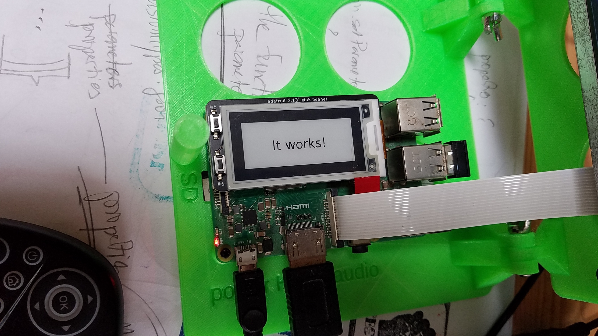
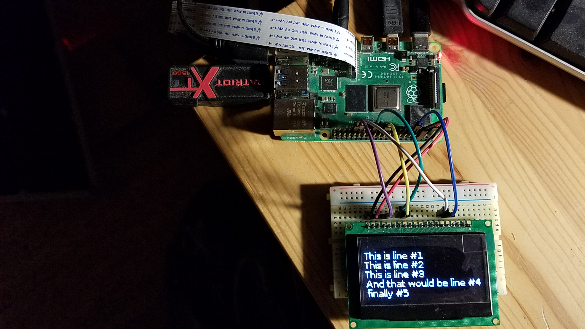

## HTTP Client Samples
This module refers to its sibling `http-client-paradigm`.

We will show here how to use several sensors and screens, managed from Python,
having their features exposed through an HTTP server - written in Python as well -
so they can be reached from any HTTP Client, written in Java in our case.

`curl`, `PostMan`, and others, behave exacty the same.

In each `python` directory of this module you will find:
- Some examples (based on python code provided by the manufacturer)
- A `server` directory, containing a sample REST server communicating with the device.

## Featuring...
- Magnetometer [LIS3MDL](https://www.adafruit.com/product/4479), tutorial [here](https://learn.adafruit.com/lis3mdl-triple-axis-magnetometer).
- [Monochrome 2.42" oled screen](https://learn.adafruit.com/1-5-and-2-4-monochrome-128x64-oled-display-module?view=all), Raspberry Pi, `I2C` and `SPI`.
- [240x240 TFT](https://www.adafruit.com/product/3787), [tutorial](https://learn.adafruit.com/adafruit-1-3-and-1-54-240-x-240-wide-angle-tft-lcd-displays?view=all), look for `ST7789 and ST7735-based Displays, 1.3", 1.54", and 2.0" IPS TFT Display`.
- [2.13" E-INK](https://learn.adafruit.com/2-13-in-e-ink-bonnet?view=all).
- [240x351 mini color TFT](https://www.adafruit.com/product/4393), setup doc [here](https://learn.adafruit.com/adafruit-mini-pitft-135x240-color-tft-add-on-for-raspberry-pi?view=all#attaching-3044215-2).
- [2.42", 128x64 OLED](http://adafu.it/2719), doc and wiring [here](https://learn.adafruit.com/1-5-and-2-4-monochrome-128x64-oled-display-module?view=all#adafruit-oled-display-spi-wiring-3046037-6)
  
### Magnetometer LIS3MDL
On the Raspberry Pi, install the required python packages:
```
$ sudo pip3 install adafruit-circuitpython-lis3mdl
```
Then, on the Raspberry Pi with the `LIS3MDL` connected to it: 
```
$ cd src/main/python/lis3mdl/server
$ python3 lis3mdl_server.py --machine-name:$(hostname -I) [ --port:8888 --verbose:true ]
```
After that, from anywhere on the same network:
```
$  ./read_mag.sh 
  Ctrl+C to stop
  Heading: 148.411910 Pitch: 125.781553, Roll: -113.902522
  Heading: 148.411910 Pitch: 125.781553, Roll: -113.902522
  Heading: 148.411910 Pitch: 125.781553, Roll: -113.902522
  Heading: 148.411910 Pitch: 125.781553, Roll: -113.902522
  Heading: 148.411910 Pitch: 125.781553, Roll: -113.902522
  Heading: 148.411910 Pitch: 125.781553, Roll: -113.902522
. . .
```
The URL of the server can be modified in the `read_mag.sh` script. 

### Monochrome Screen 2.42"


### 240x240 TFT
> Note: Could NOT get it to work...

On the Raspberry pi, install the required Python artifacts:
```
$ sudo pip3 install adafruit-circuitpython-rgb-display
$ sudo apt-get install ttf-dejavu
$ sudo apt-get install python3-pil
```

### 2.13" E-INK
Install required Python libraries and artifacts on the Raspberry PI:
```
$ sudo pip3 install adafruit-circuitpython-epd
$ wget https://github.com/adafruit/Adafruit_CircuitPython_framebuf/raw/master/examples/font5x8.bin
$ sudo apt-get install ttf-dejavu
$ sudo apt-get install python3-pil
```

Then, on the Raspberry Pi with the `EINK` connected to it: 
```
$ cd src/main/python/eink_2.13/server
$ python3 eink_2.13_server.py --machine-name:$(hostname -I) [ --port:8888 --verbose:true ]
```
After that, from anywhere on the same network:

Client request:
```
$ curl --location --request POST 'http://192.168.42.36:8080/eink2_13/display' \
--header 'Content-Type: text/plain' \
--data-raw 'It works!'
```


Or use the script named `eink.sh`:
```
$ ./eink.sh 
  Requests will be POSTed to http://192.168.42.36:8080/eink2_13/display
  You say ? ('Q' to quit) > tagada
    % Total    % Received % Xferd  Average Speed   Time    Time     Time  Current
                                   Dload  Upload   Total   Spent    Left  Speed
  100    22  100    16  100     6      3      1  0:00:06  0:00:04  0:00:02     3
  {
    "status": "OK"
  }
  You say ? ('Q' to quit) > Argh!
    % Total    % Received % Xferd  Average Speed   Time    Time     Time  Current
                                   Dload  Upload   Total   Spent    Left  Speed
  100    21  100    16  100     5      3      1  0:00:05  0:00:04  0:00:01     4
  {
    "status": "OK"
  }
  You say ? ('Q' to quit) > Q
  Bye!
```

## 240x135 mini color TFT
Install the required libs and artifacts:
```
$ sudo pip3 install adafruit-circuitpython-rgb-display
$ sudo pip3 install --upgrade --force-reinstall spidev
$ sudo apt-get install ttf-dejavu 
$ sudo apt-get install python3-pil
$ sudo apt-get install python3-numpy
```
See the script named `rgb_display_minipitfttest.py` and execute it
```
$ sudo python3 rgb_display_minipitfttest.py
```
Same for `rgb_display_minipitftstats.py`


#### The server
Run
```
$ python3 miniTFT240x135_server.py --machine-name:$(hostname -I)
```

Then, anywhere on the same network:
```
curl --location --request POST 'http://192.168.42.6:8080/miniTFT/display' \
--header 'Content-Type: application/json' \
--data-raw '{
    "rotation": 270,
    "bg-color": "#000000",
    "text": [
        {
            "x": 2,
            "y": 0,
            "text": "This is line #1",
            "size": 18,
            "color": "#ffffff"
        },
        {
            "x": 2,
            "y": 18,
            "text": "This is line #2",
            "color": "#0000ff"
        },
        {
            "x": 2,
            "y": 36,
            "text": "This is line #3",
            "color": "#ff0000"
        },
        {
            "x": 2,
            "y": 54,
            "text": "And that would be line #4",
            "color": "#0000ff"
        },
        {
            "x": 2,
            "y": 72,
            "text": "Goingon, line #6",
            "color": "#ffff00"
        },
        {
            "x": 2,
            "y": 90,
            "text": "Even more, line #7",
            "color": "#ffffff"
        },
        {
            "x": 2,
            "y": 108,
            "text": "up to line #8",
            "color": "#00ff00"
        }
    ]
}'
```

## 2.42", 128x64 OLED, SPI version for now
- Install required libraries and artifacts
```
$ pip3 install adafruit-circuitpython-ssd1305
$ sudo apt-get install python3-pil
```
Details in [its folder](./src/main/python/2.42in.128x64OLED/README.md)


---
 